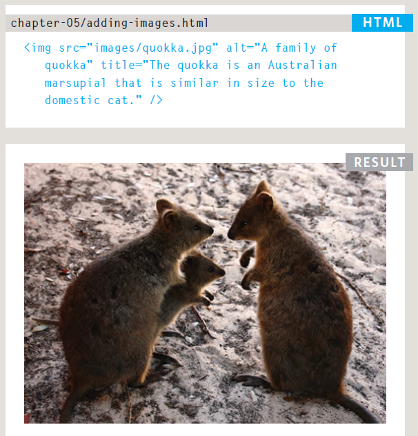
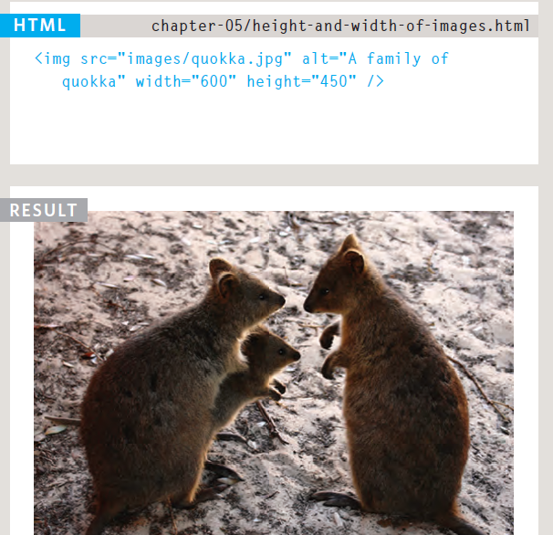
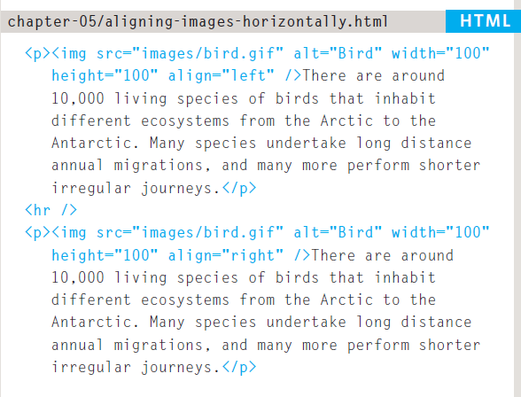
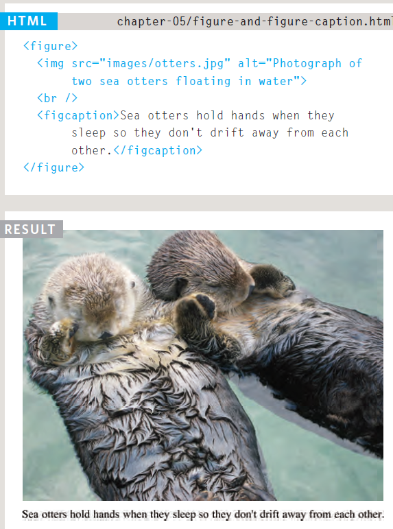
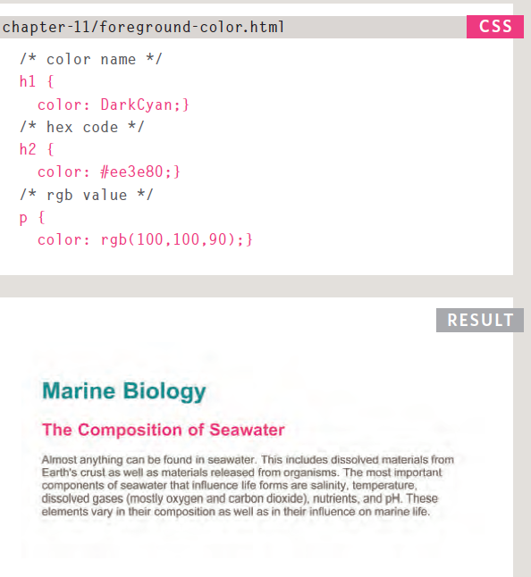
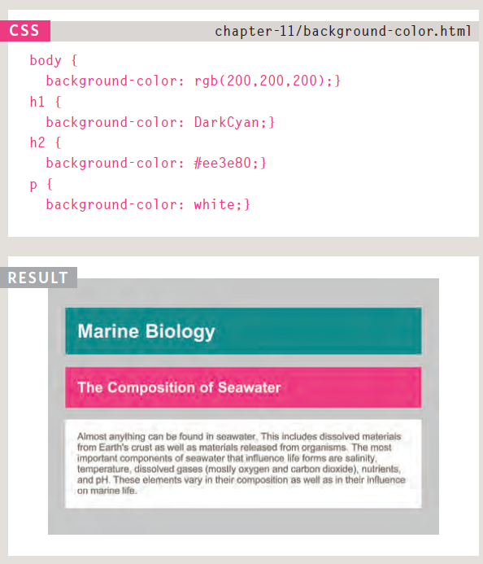
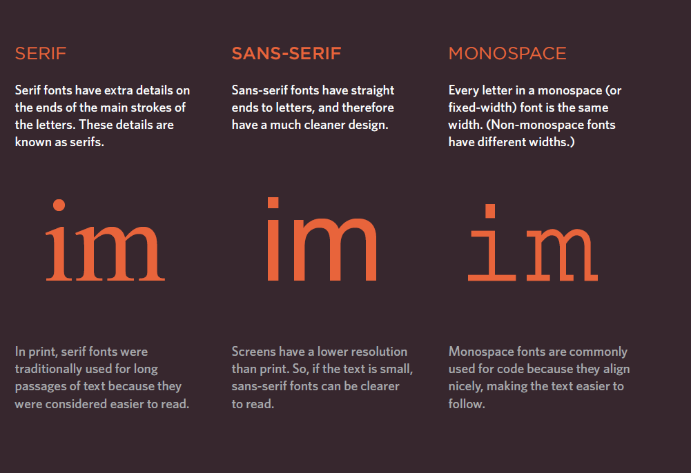
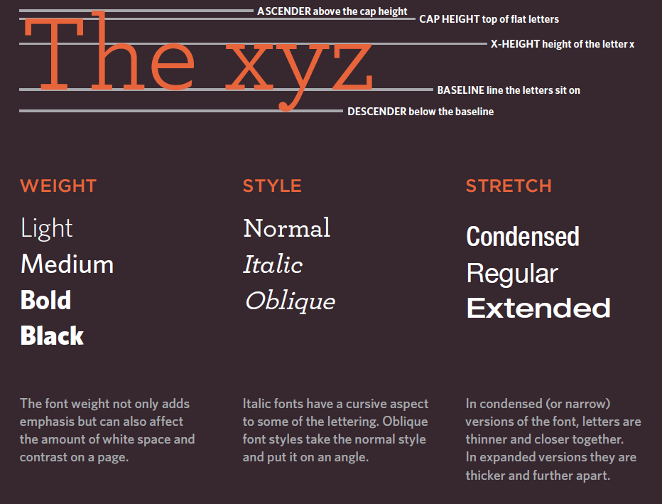
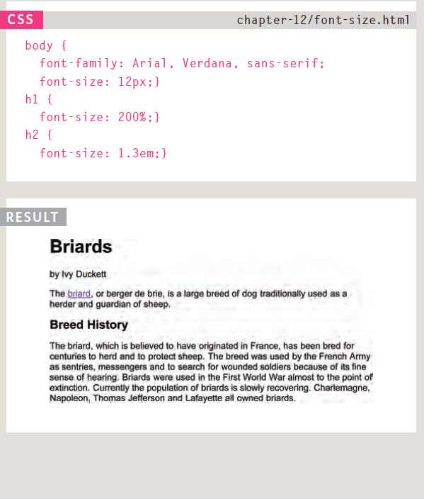
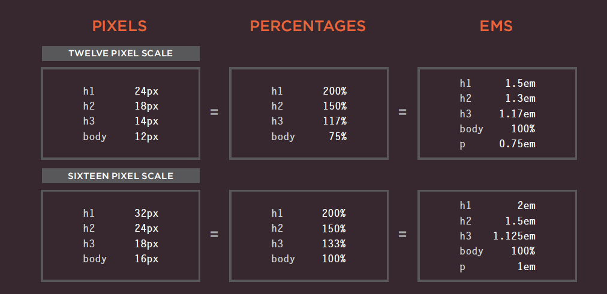

## Images

There are many reasons why you might
want to add an image to a web page: you
might want to include a logo, photograph,
illustration, diagram, or chart.
There are several things to consider when selecting and
preparing images for your site, but taking time to get them
right will make it look more attractive and professional.
In this chapter you will learn how to:
Include an image i n your web pages using HTML
* Pick which image format to use
* Show an image at the right size
* Optimize an image for use on the web to make pages load faster

Storing Images on Your Site

If you are building a site from scratch, it is good practice to create a folder for all of the images the site uses.

## Adding Images

## Height & Width of Images

## Aligning Images Horizontally

### by using align you can also put the image on the top or middle or bottom

## HTML5 : Figure and Figure Caption

## Color
### * Foreground Color

### * background-color

## Text 

The properties that allow you to control
the appearance of text can be split into
two groups:
* Those that directly affect the font and its appearance
(including the typeface, whether it is regular, bold or italic,
and the size of the text)
 * Those that would have the same effect on text no matter
what font you were using (including the color of text and
the spacing between words and letters)
The formatting of your text can have a significant effect
on how readable your pages are. 

### Typeface Terminology

### Choosing a Typeface for your Website

1. Serif : Serif fonts have extra details on the end of the main strokes of the letters.

2. Sans-Serif : Sans-serif fonts have straight ends to letters and therefore have a much cleaner design.

3. Monospace : Every letter in a monospace typeface is the same width. (Non-monospace fonts have different widths.)

4. Cursive : Cursive fonts either have joining strokes or other cursive characteristics, such as handwriting styles.

5. Fantasy : Fantasy fonts are usually decorative fonts and are often used for titles. They're not designed for long bodies of text.

### font-size 

## Units of Type Size

