## ANONYMOUS FUNCTIONS & FUNCTION EXPRESSIONS

Expressions produce a value. They can be used where values are expected. 

## IMMEDIATELY INVOKED FUNCTION EXPRESSIONS

This way of writing a function is used in several different situations.
Often functions are used to ensure that the variable names do not conflict with each other (especially if the page uses more than one script).

## WHILE LOOPS

Loops can execute a block of code as long as a specified condition is true.

## USING WHILE LOOPS

while (condition) 

{

  // code block to be executed
}

## DO WHILE LOOPS

 The do while loop is a variant of the while loop. This loop will execute the code block once, before checking if the condition is true, then it will repeat the loop as long as the condition is true.

## USING DO WHILE LOOPS

do 

{

  // code block to be executed
}

while (condition);

## Document Object Model

The Document Object Model (DOM) specifies how browsers should create a model of an HTML page and how JavaScript can access and update the contents of a web page while it is in the browser window.

## THE DOM TREE IS A MODEL OF A WEB PAGE

As a browser loads a web page, it creates a model of that page. The model is called a DOM tree, and it is stored in the browser's' memory. It consists of four main types of nodes.

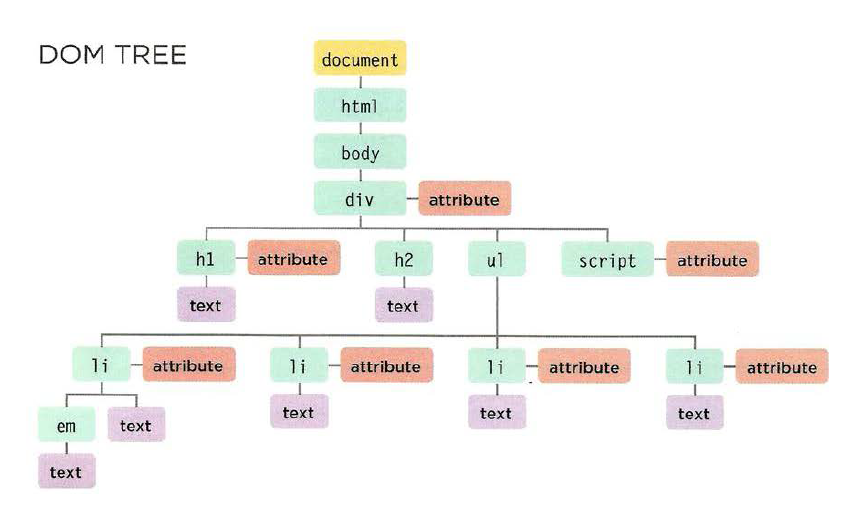

## WORKING WITH THE DOM TREE

1. 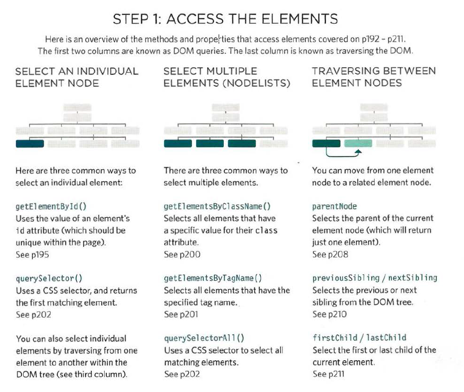

### The terms elements and element nodes are used interchangeably but when people say the DOM is working with an element, it is actually working with a node that represents that element.

2. 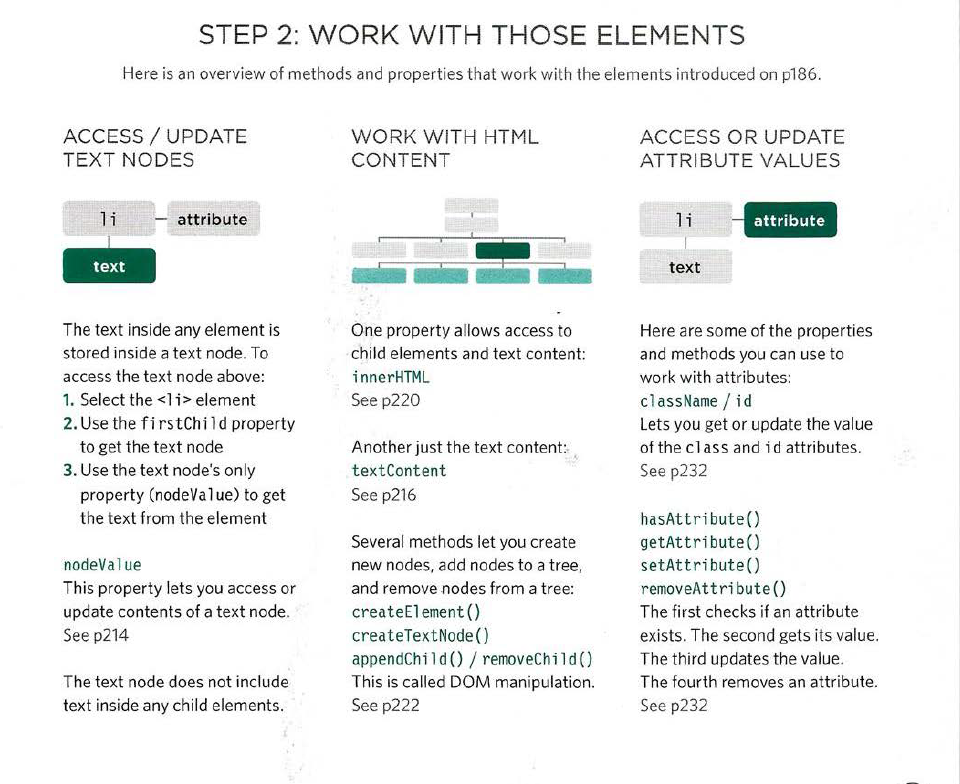

## ACCESSING ELEMENTS

DOM queries may return one element, or they may return a Nodelist,which is a collection of nodes

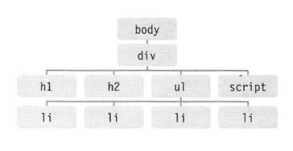

## SELECTING ELEMENTS USING ID ATTRIBUTES

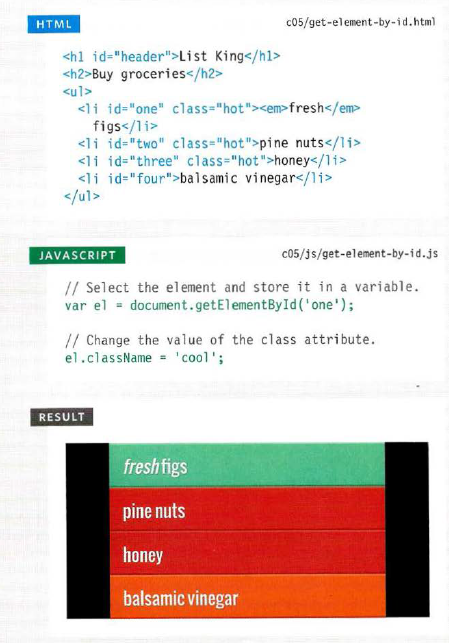

#### NODELISTS: DOM QUERIES THAT RETURN MORE THAN ONE ELEMENT
When a DOM method can return more than one element, it returns a Nodelist (even if it only finds one matching element).

### SELECTING AN ELEMENT FROM A NODELIST

There are two ways to select an element from a Nodelist:
The item() method and array syntax.
Both require the index number of the element you want.

THE Item{) METHOD

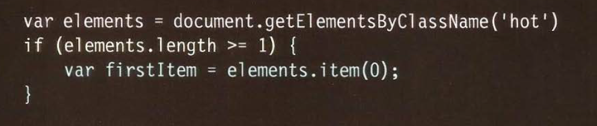

### LOOPING THROUGH A NODELIST

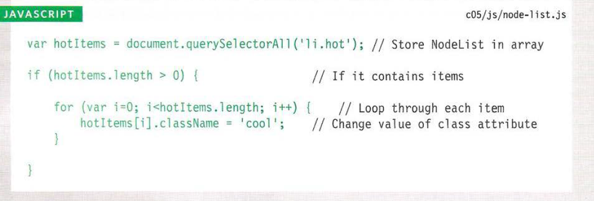

### TRAVERSING THE DOM

When you have an element node, you can select another element in relation to it using these five properties. This is known as traversing the DOM.

### WHITESPACE NODES

Traversing the DOM can be difficult because some browsers add a text node whenever they come across whitespace between elements.

## ADDING ELEMENTS USING DOM MANIPULATION

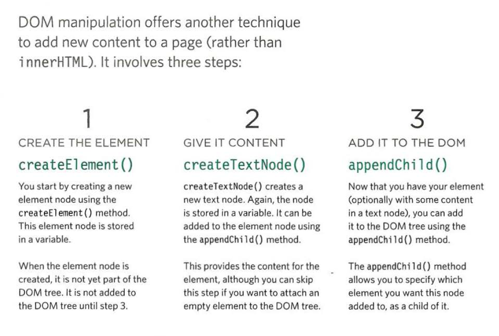

### ADDING AN ELEMENT TO THE DOM TREE: 

* createElement () creates an element that can be added to the DOM tree, in this case an empty <l i >element for the list.

* This new element is stored inside a variable called newEl until it is attached to the DOM tree later on.

* createTextNode() allows you to create a new text node to attach to an element. It is stored in a variable called newText.

### REMOVING ELEMENTS VIA DOM MANIPULATION:
DOM manipulation can be used to remove elements from the DOM tree.
1. STORE THE ELEMENT TO BE REMOVED IN A VARIABLE
2. STORE THE PARENT OF THAT ELEMENT IN A VARIABLE
3. REMOVE THE ELEMENT FROM ITS CONTA INING ELEMENT

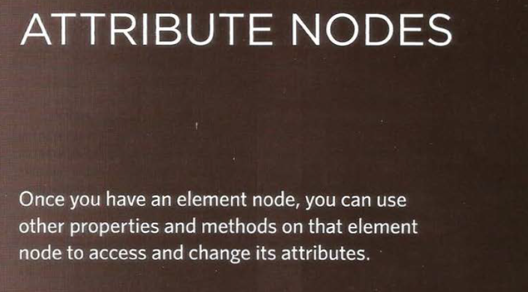
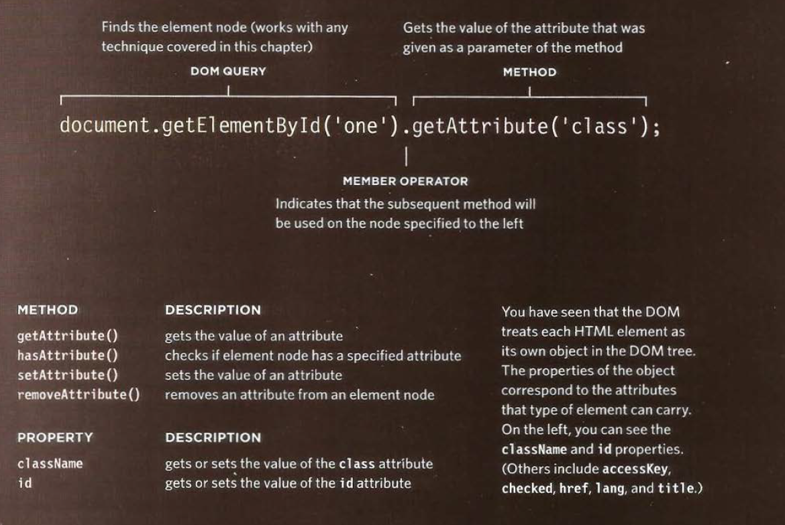

### CHECK FOR AN ATTRIBUTE AND GET ITS VALUES

* Before you work with an attribute, it is good practice to check whether it exists. This will save resources if the attribute cannot be found.

* The hasAttri bute() method of any element node lets you check if an attribute exists. The attribute name is given as an argument in the parentheses.

* Using hasAttribute() in an if statement like this means that the code inside the curly braces will run only if the attribute exists on the given element.

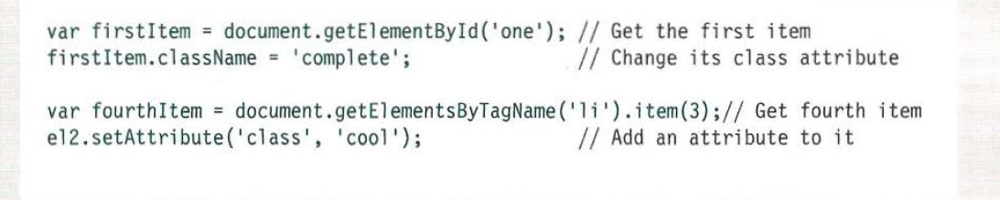

### REMOVING ATTRIBUTES

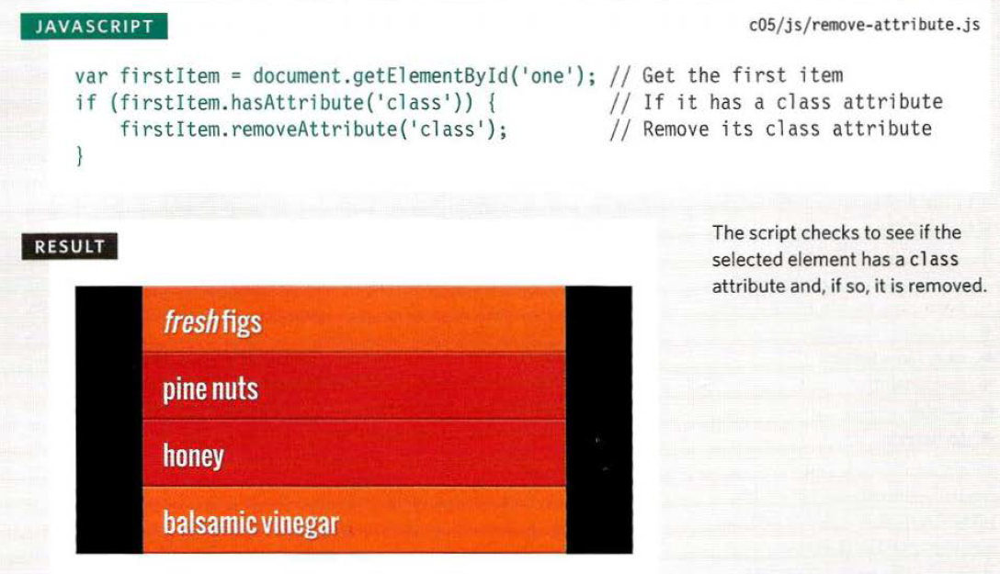

