## Tables

### What's a Table?

A table represents information in a grid format.
Examples of tables include financial reports, TV
schedules, and sports results.

## Basic Table St ructure

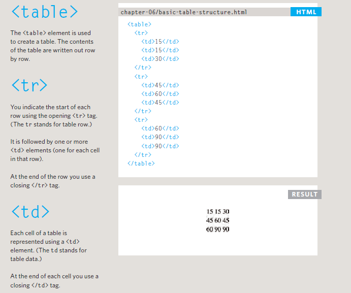

## Table Headings
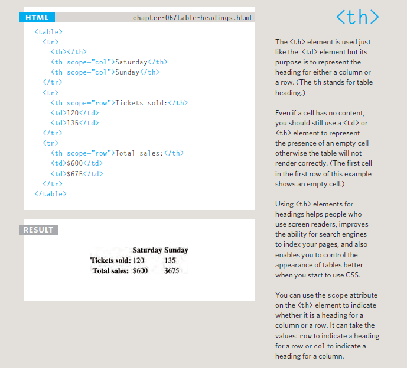

## Spanning ColumnS

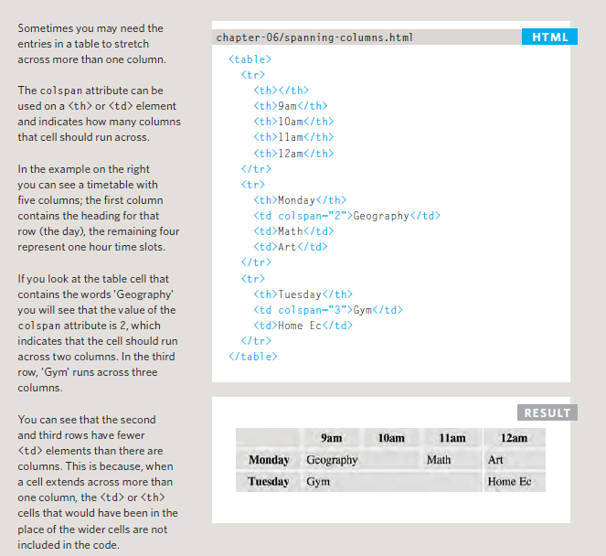

## Spanning Rows
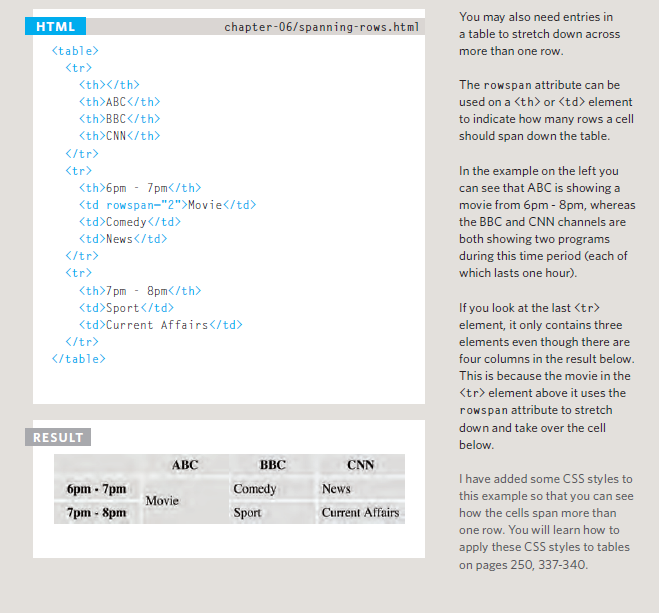

## Long Tables

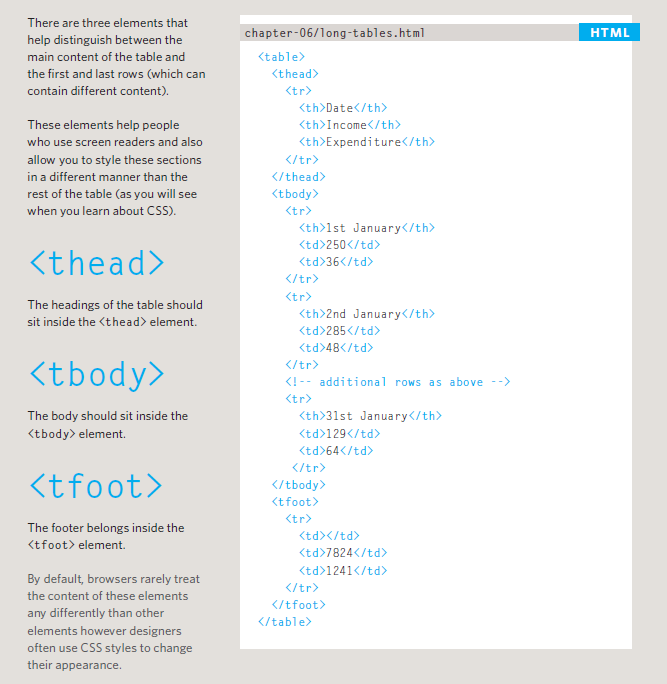

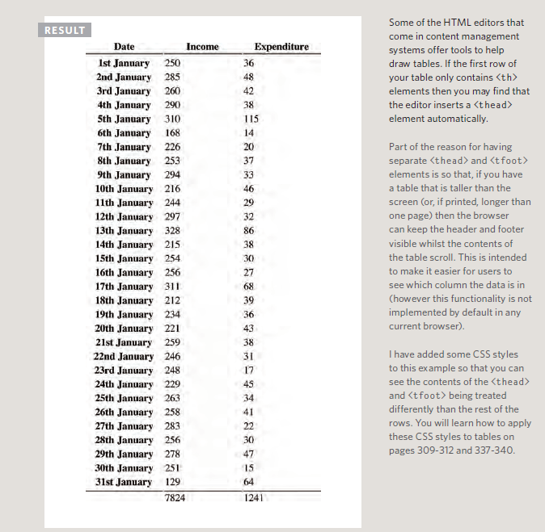

## HOW MEMORY & VARIABLES WORK

Global variables use more memory. The browser has to remember them
for as long as the web page using them is loaded. Local variables are only
remembered during the period of time that a function is being executed.

## WHAT IS AN OBJECT?

Objects group together a set of variables and functions to create a model
of a something you would recognize from the real world. In an object,
variables and functions take on new names.

This object represents a hotel. It has five properties and one method.
The object is in curly braces. It is stored in a variable called hotel .

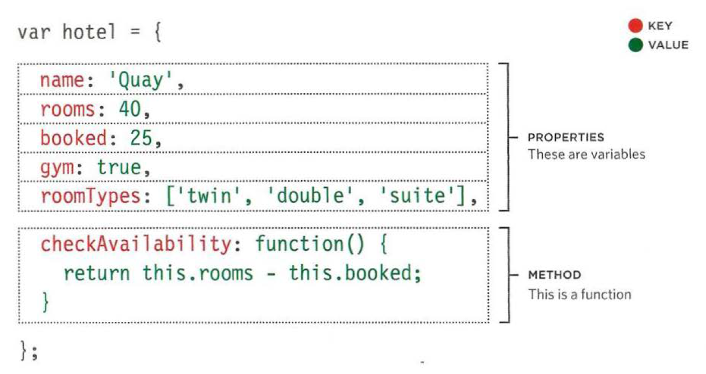

## CREATING· OBJECTS USING LITERAL NOTATION
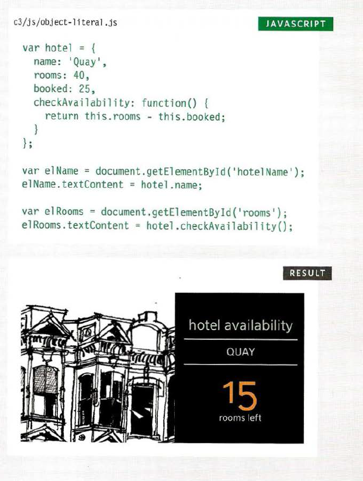

## Updating an object

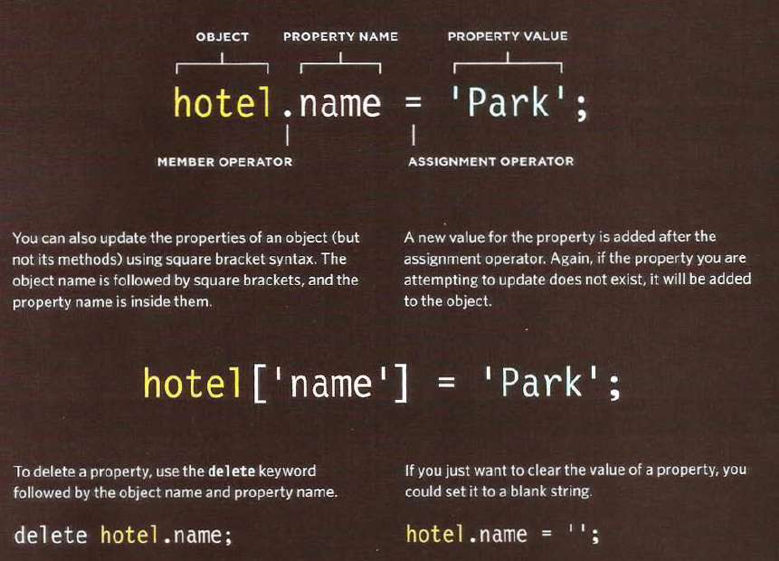

## CREATE & ACCESS OBJECTS CONSTRUCTOR NOTATION
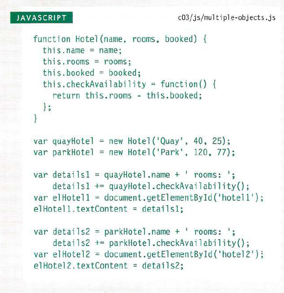

## RECAP: WAYS TO CREATE OBJECTS\

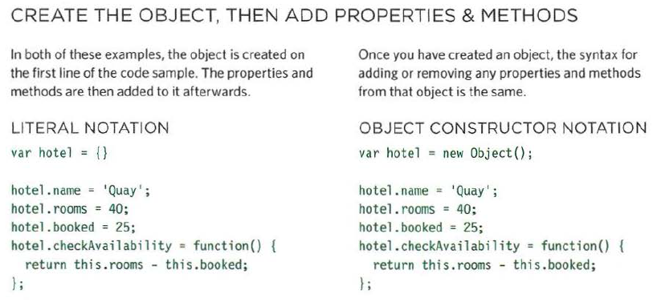

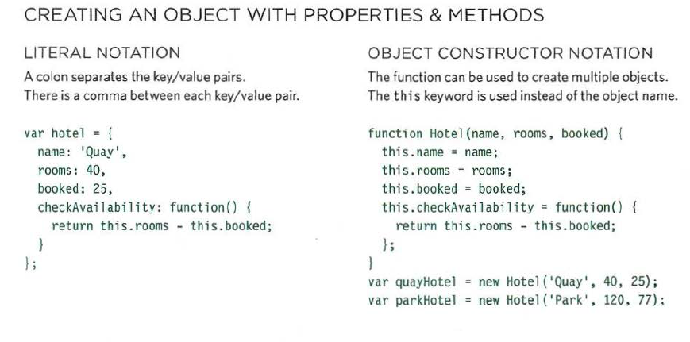

## THIS (IT IS A KEYWORD)
The keyword this is commonly used inside functions and objects.
Where the function is declared alters what this means. It always refers
to one object, usually the object in which the function operates.

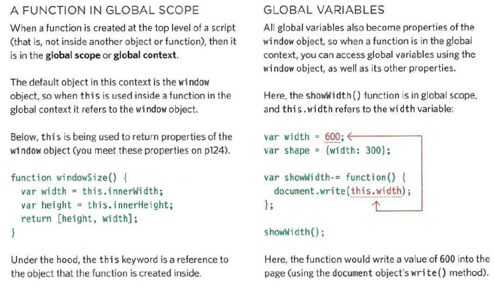

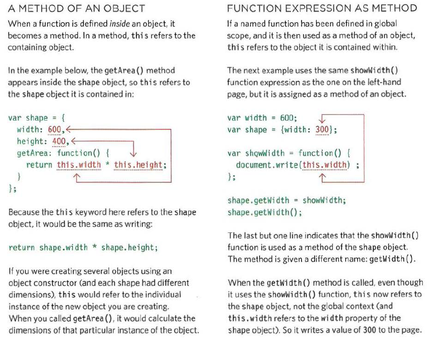

## WHAT ARE BUILT-IN OBJECTS?

Browsers come with a set of built-in objects that represent things like the browser window and the current web page shown in that window. These built-in objects act like a toolkit for creating interactive web pages.

The first thing you need to do is get to know what tools are available.
You can imagine that your new toolkit has three compartments:

1. BROWSER OBJECT MODEL
2. DOCUMENT OBJECT MODEL
3. GLOBAL JAVASCRIPT OBJECTS

## THE BROWSER OBJECT MODEL: THE WINDOW OBJECT

The window object represents the current browser window or tab. It is the topmost object in the Browser Object Model, and it contains other objects that tell you about the browser.

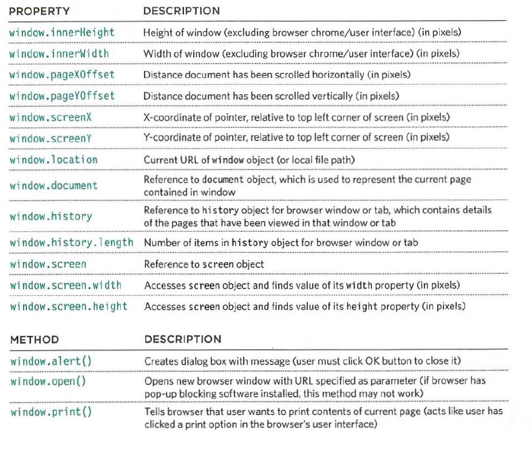

## USING THE BROWSER OBJECT MODEL

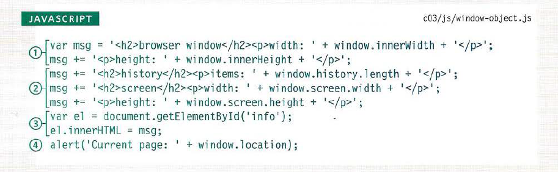

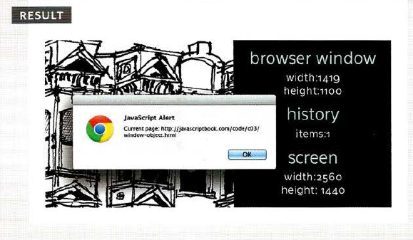

## THE DOCUMENT OBJECT MODEL: THE DOCUMENT OBJECT
The topmost object in the Document Object Model (or DOM) is the document object. It represents the web page loaded into the current browser window or tab. 

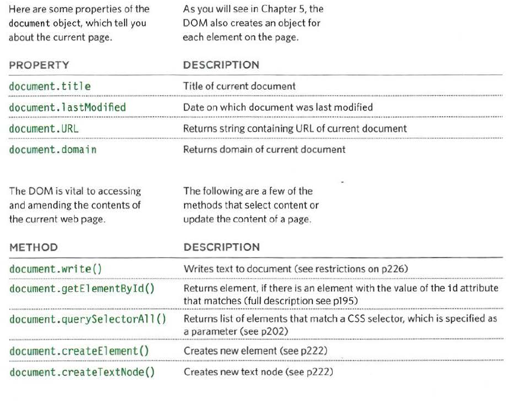

## USING THE DOCUMENT OBJECT

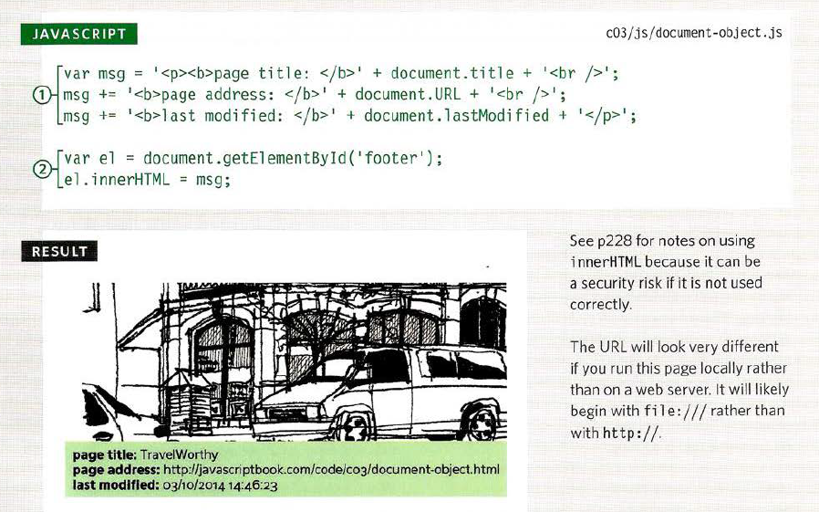

## GLOBAL OBJECTS: STRING OBJECT

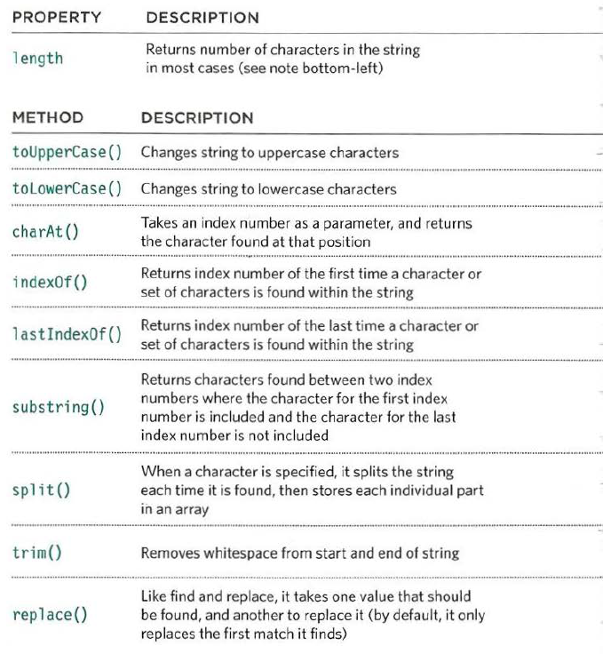

## DATA TYPES REVISITED

In JavaScript there are six data types:
Five of them are described as simple (or primitive) data types.
The sixth is the object (and is referred to as a complex data type).

1. String
2. Number
3. Boolean
4. Undefined : a variable that has been declared, but no value has been assigned to it yet
5. Null : a variable with no value - it may have had one at some point, but no longer has a value
6. 0bject 

