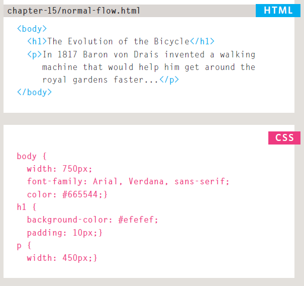
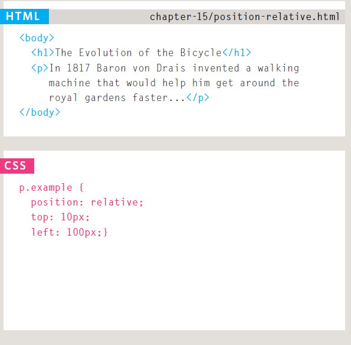
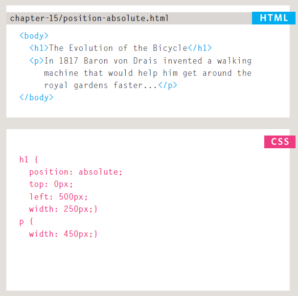
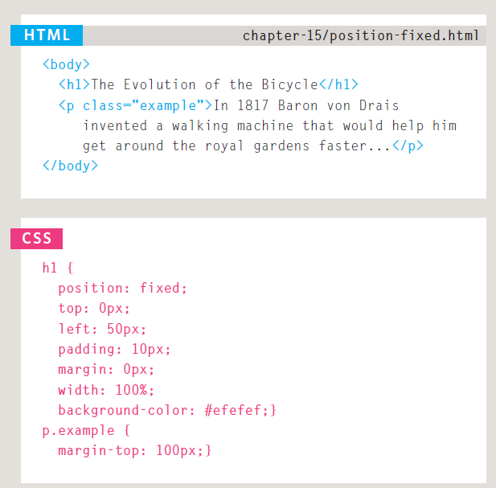
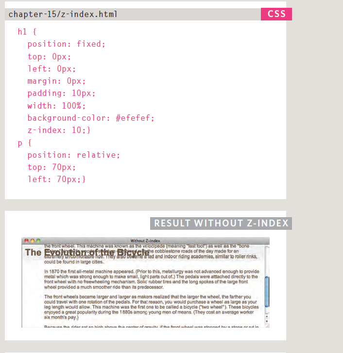
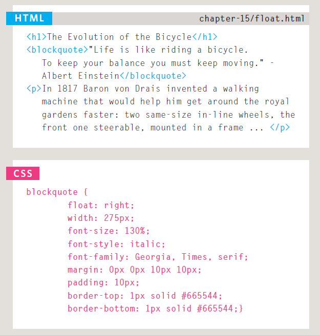
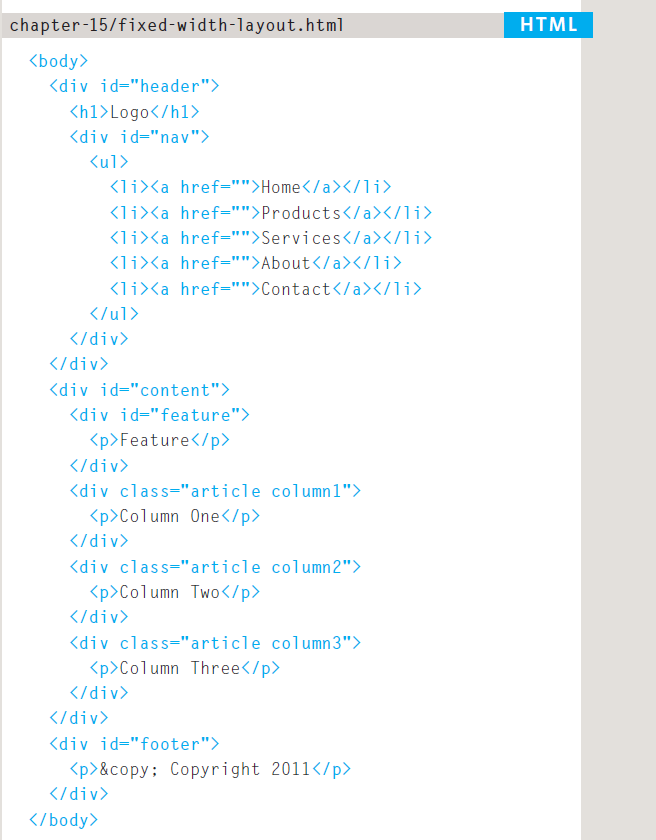
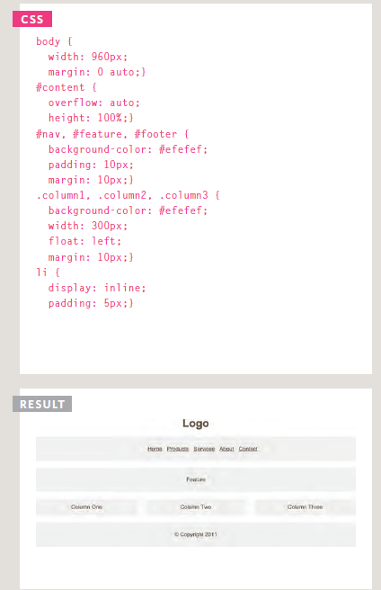
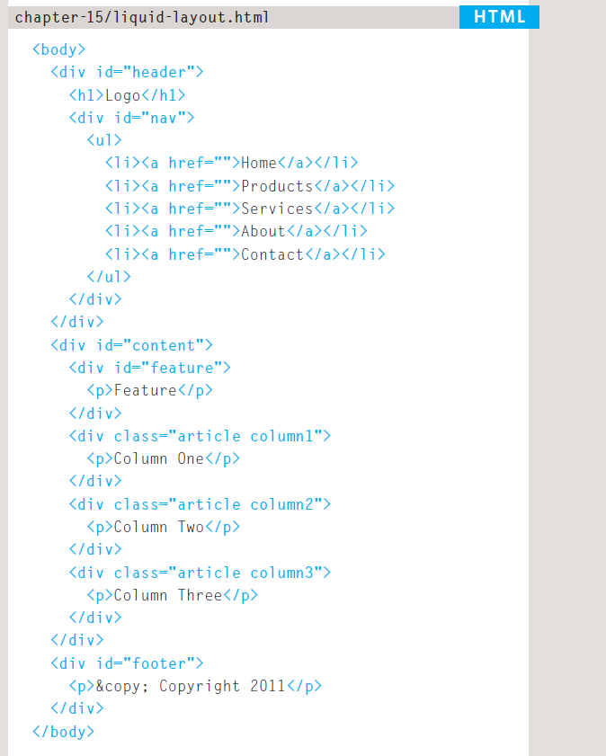
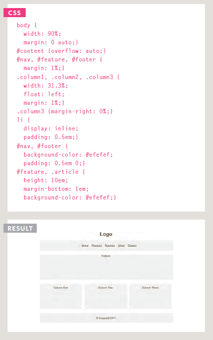

# Layout

## Key Concepts in Positioning Elements

* Building Blocks : CSS treats each HTML element as if it is in its own box. This box will either be a block-level box or an inline box.

* Containing Elements : If one block-level element sits inside another block-level element then the outer box is known as the containing or parent element.

## Controll ing the Position of Elements

CSS has the following positioning schemes that allow you to control the layout of a page: normal flow, relative positioning, and absolute positioning. You specify the positioning scheme using the position property in CSS. You can also float elements using the float property.

## Normal Flow
position:static

## Relative Positioning
position:relative

## Absolute Positioning
position:absolute

## Fixed Positioning
position:fixed

## Overlapping Elements
z-index

## Floating Elements
Float

## Screen Sizes

Different visitors to your site will have different sized screens that show different amounts of information, so your design needs to be able to work on a range of different sized screens.

## Screen Resolution
Resolution refers to the number of dots a screen shows per inch. Some devices have a higher resolution than desktop computers and most operating systems allow users to adjust the resolution of their screens.

## Page Sizes
Because screen sizes and display resolutions vary so much, web designers often try to create pages of around 960-1000 pixels wide (since most users will be able to see designs this wide on their screens).

## Fixed Width Layouts
Fixed width layout designs do not change size as the user increases
or decreases the size of their browser window. Measurements tend to be given in pixels.

## Liquid Layouts
Liquid layout designs stretch and contract as the user increases or decreases the size of their browser window. They tend to use percentages.

## Layout Grids

Composition in any visual art (such as design, painting, or photography) is the placement or arrangement of visual elements — how they are organized on a page. Many designers use a grid structure to help them position items on a page, and the same is true for web designers.

## CSS Frameworks
CSS frameworks aim to make your life easier by providing the code for common tasks, such as creating layout grids, styling forms, creating printer-friendly versions of pages and so on. You can include the CSS framework code in your projects rather than writing the CSS from scratch.

