## Forms

The best known form on the web is probably the search box that sits right in the middle of Google's homepage.

## Form Controls

There are several types of form controls that you can use to collect information from visitors to your site.

like: 
1. ADDING TEXT:
* Text input (single-line)
* Password input
* Text area (multi-line)
2. Ma king Choices:
* Radio buttons
* Checkboxes
* Drop-down boxes
3. Submitting Forms:
* Submit buttons
* Image buttons
4. Uploading Files:
* File upload

## Form Structure
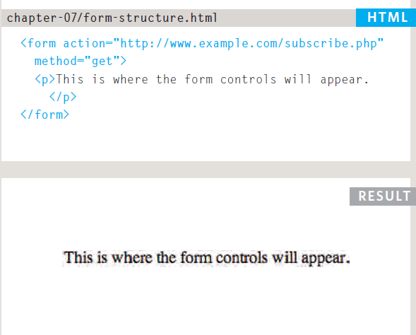

## Text Input

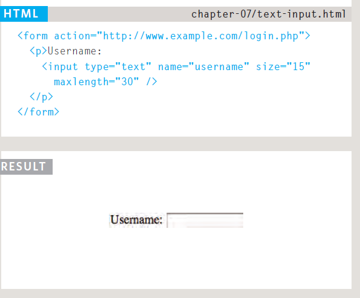

## Password Input
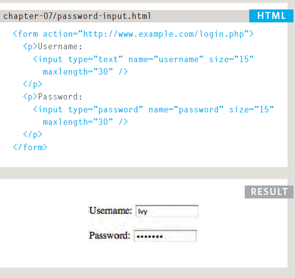

## TEXT Area

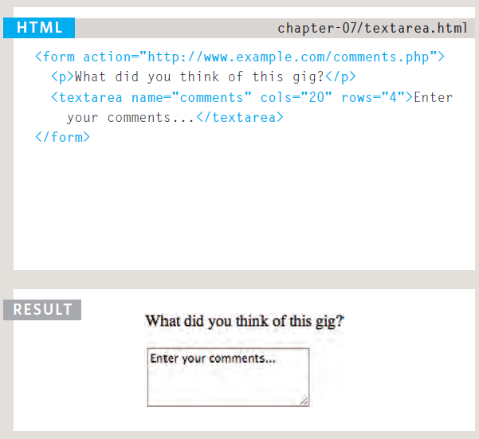

## Radio Button

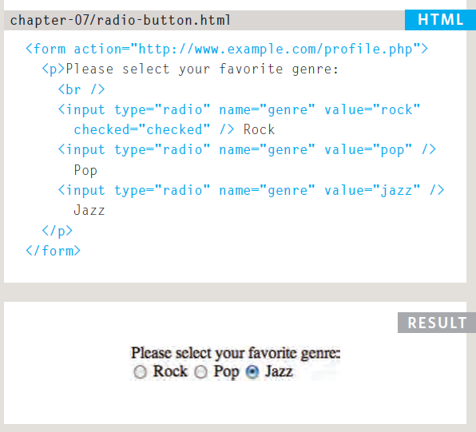

## Check box
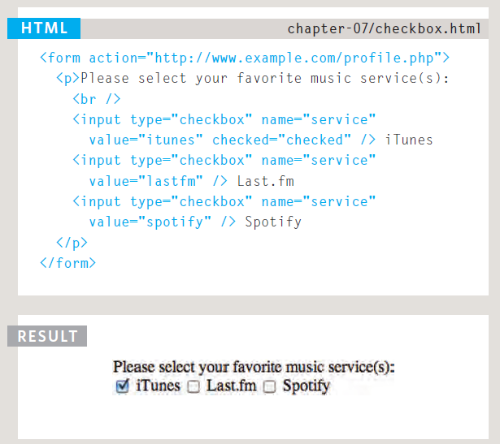

## Drop Down List Box

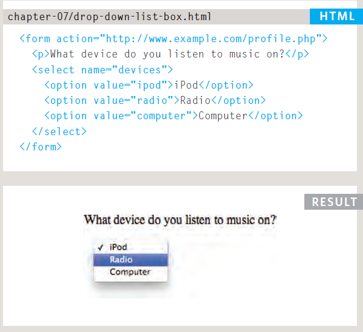

## Multiple Select Box
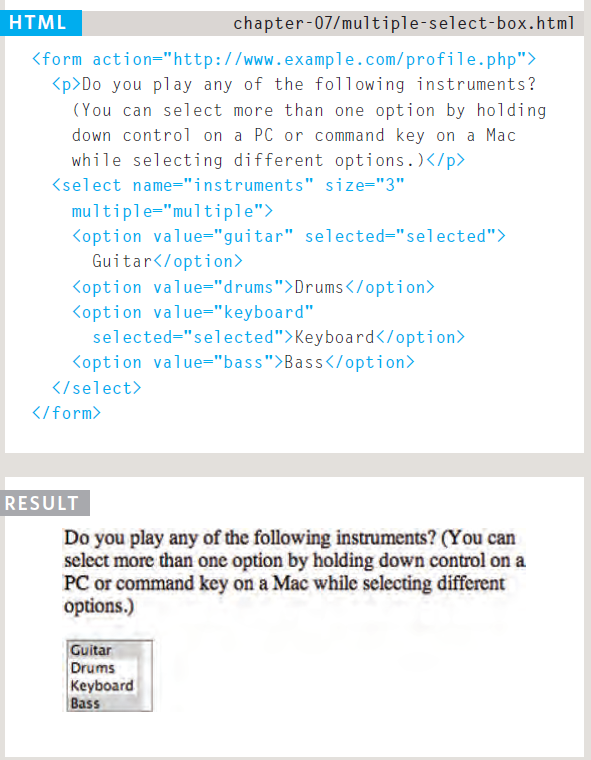

## File Input Box (uplode)
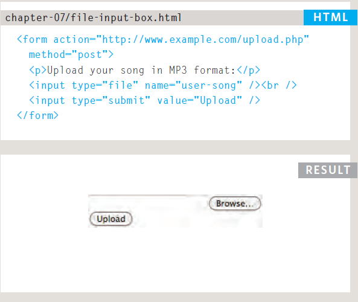

## Submit Button
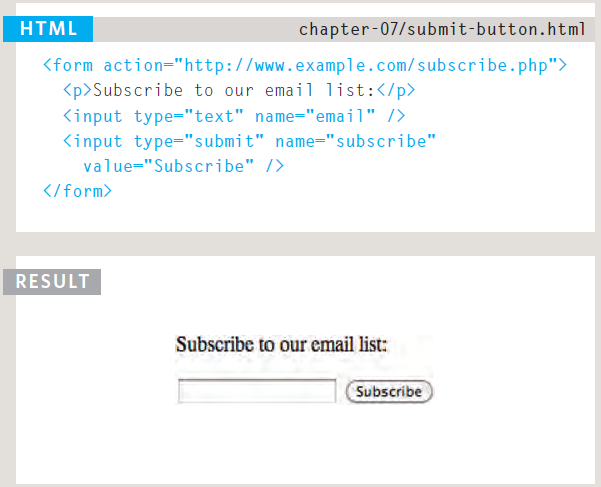

## Image Button

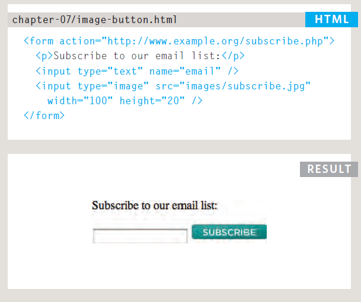

## Button & HIDDEN Controls
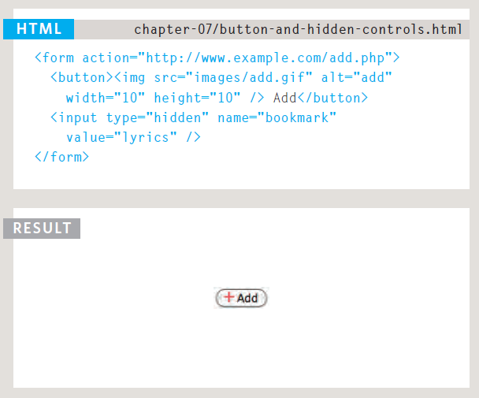

## Labelling Form Controls

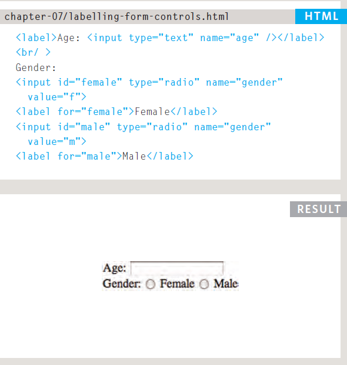

## Grouping Form Elements

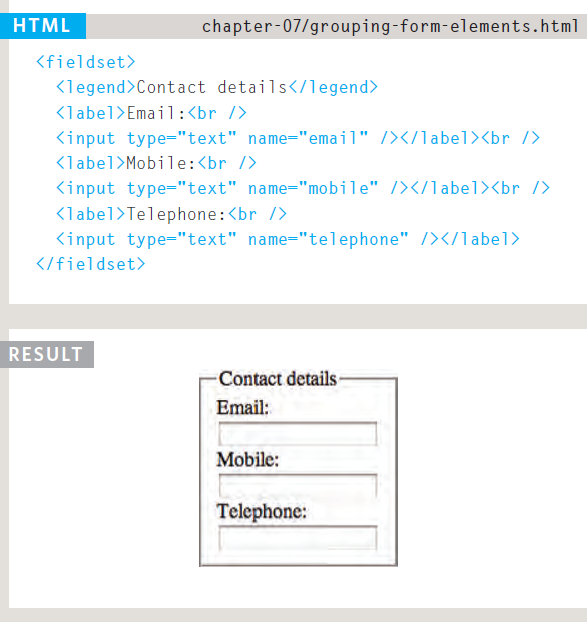

## HTML 5: Form Validation

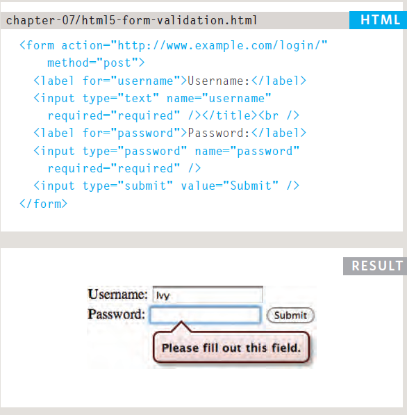

## HTML 5: Search Input

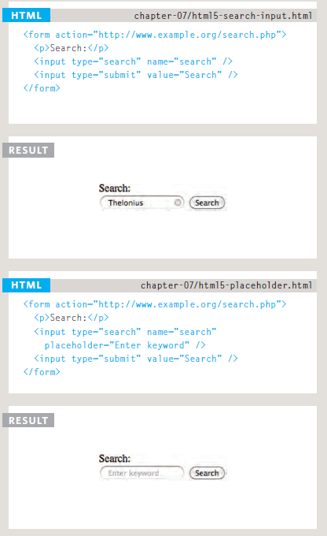

## Images for BULLETS
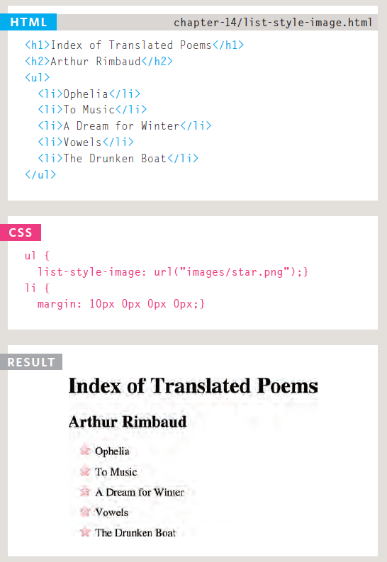

## Styling Text Inputs
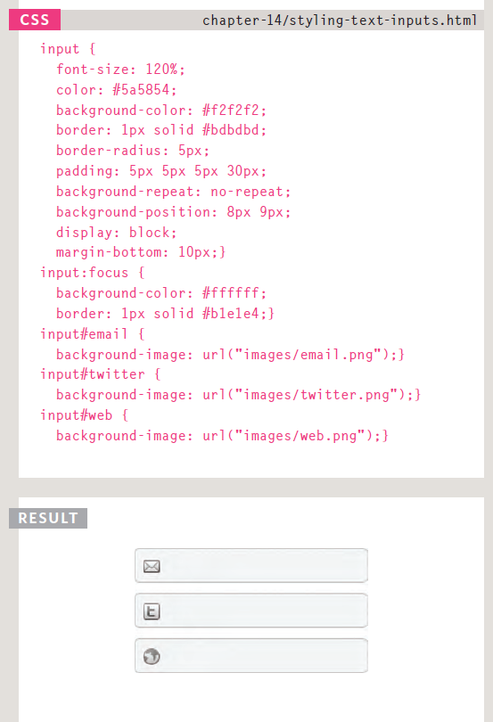

## Styling Submit Buttons
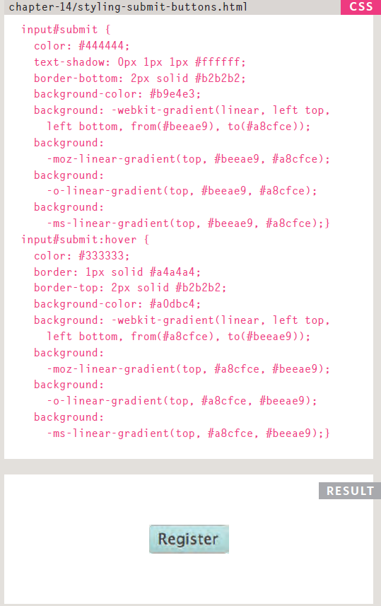
## Styling Fieldsets & Legends

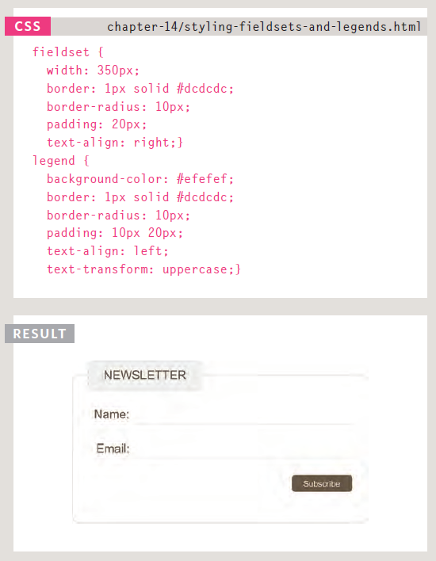

## EVENT

## DIFFERENT EVENT TYPES

Here is a selection of the events that occur in the browser while you are browsing the web. Any of these events can be used to trigger a function in your JavaScript code.

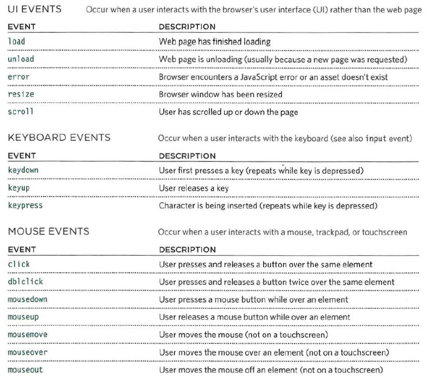

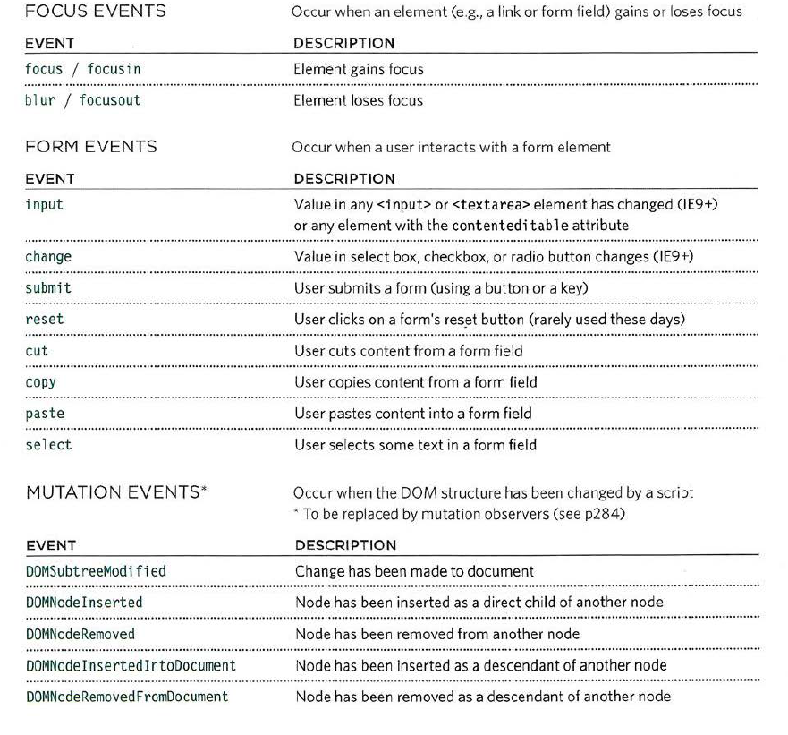

## HOW EVENTS TRIGGER JAVASCRIPT CODE
When the user interacts with the HTML on a web page, there are three
steps involved in getting it to trigger some JavaScript code.
Together these steps are known as event handling

1. Select t he element node(s) you want the script to respond to.
2. Indicate which event on the selected node(s) will trigger the response.
3. State the code you want to run when the event occurs.

## TRADITIONAL DOM EVENT HANDLERS All

element .onevent functionName ;

## EVENT LISTENERS 

element .addEventlistener('event', functionName [, Boolean]) ;

## USING EVENT LISTENERS

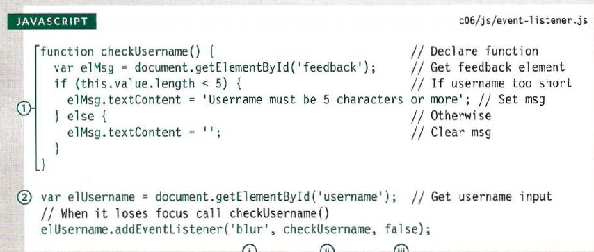

## FOCUS & BLUR EVENTS

The HTML elements you can interact with, such as links and form elements, can gain focus. These events fire when they gain or lose focus.

## MOUSE EVENTS
The mouse events are fired when the mouse is moved and also when its buttons are clicked.
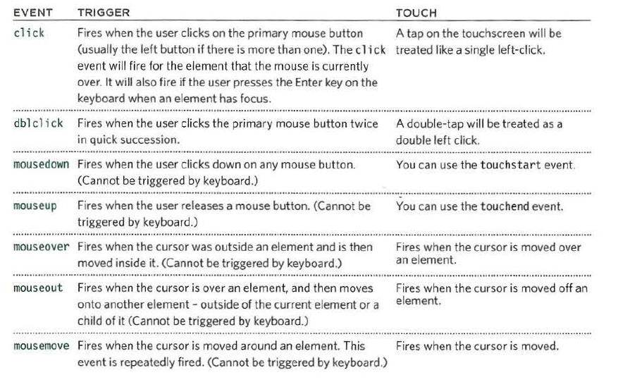

## FORM EVENTS

There are two events that are commonly used with forms. In particular you are likely to see submit used in form validation.
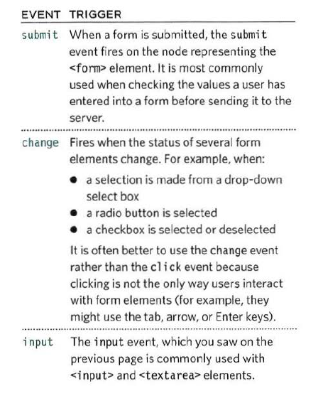

