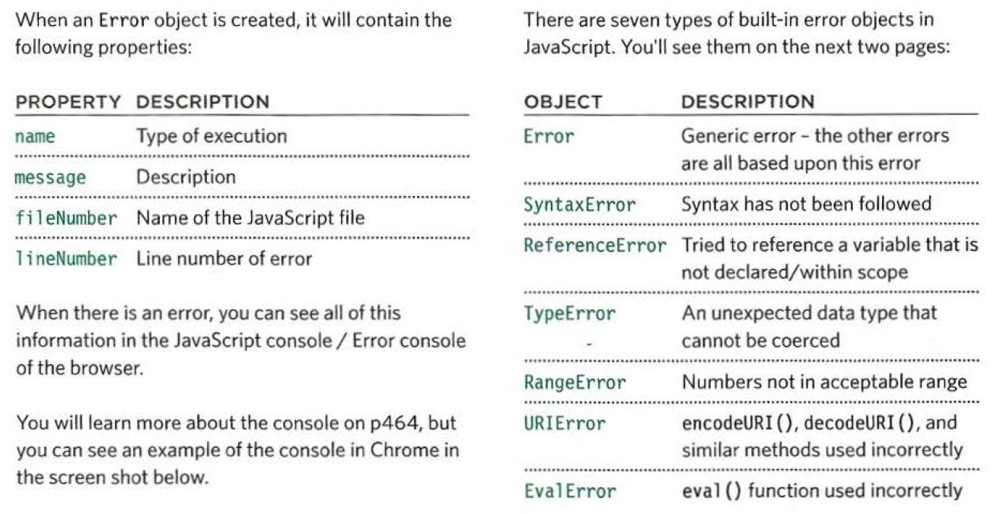
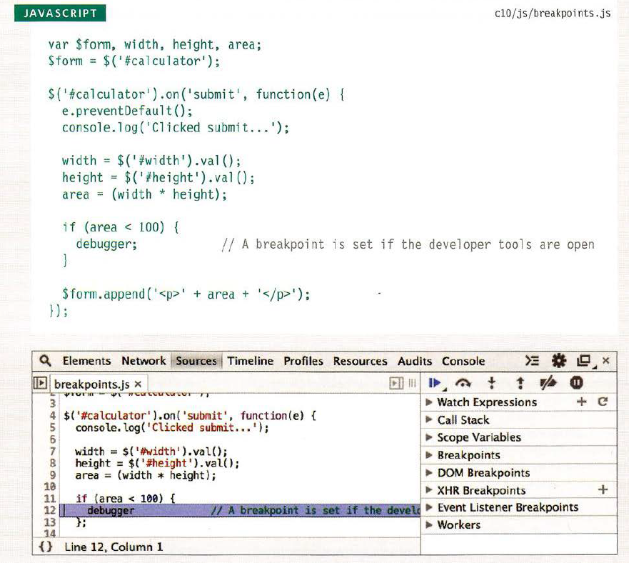

## Error Handling & Debugging

JavaScript can be hard to learn and everyone makes mistakes when writing it. This chapter will help you learn how to find the errors in your code. It will also teach you how to write scripts that deal with potential errors gracefully. 

## ORDER OF EXECUTION
To find the source of an error, it helps to know how scripts are processed.
The order in which statements are executed can be complex; some tasks
cannot complete until another statement or function has been run:

## EXECUT.ION CONTEXTS
The JavaScript interpreter uses the concept of execution contexts. There is one global execution context; plus, each function creates a new new execution context. They correspond to variable scope.

## The stack 
The JS interpreter processes one line of code at a time . when a statement needs data from another function, it stacks (or piles) the new function on top of the current task

## EXECUTION CONTEXT & HOISTING

Each time a script enters a new execution context, there are two phases of activity:

1. PREPARE 
* The new scope is created
* Variables, functions, and arguments are created
* The value of the this keyword is determined

2. EXECUTE

* Now it can assign values to variables
* Reference functions and run their code
* Execute statements

## UNDERSTANDING SCOPE

In the interpreter, each execution context has its own varibles object. It holds the variables, functions, and parameters available within it. Each execution context can also access its parent's varibles object

## UNDERSTANDING ERRORS 

If a JavaScript statement generates an error, then it throws an exception. At that point, the interpreter stops and looks for exception-handling code.

## ERROR OBJECTS

Error objects can help you find where your mistakes are and browsers have tools to help you read them.

## ERROR OBJECTS CONTINUED

* Syntax Error : 
1. SYNTAX IS NOT CORRECT
2. SyntaxError: Unexp ec t ed EOF
3. SyntaxErr or : Expected token ' ) '
4. SyntaxError: Expected token ']'
5. Synt axError: Expected an identifier but found 'name ' instead

* Ref erenceError : 
1. VARIABLE DOES NOT EXIST
2. ReferenceError: Can ' t find vari able: height
3. ReferenceError: Can't find variable : randomFunction

* EvalError :
1. INCORRECT USE OF eval() FUNCTION

* URI Error :
1. INCORRECT USE OF URI FUNCTIONS
2. URlError: URI error

* Type Error :
1. VALUE IS UNEXPECTED DATA TYPE
2. TypeError: 'undefined' is not a funct ion (eval uating 'Document.write('Oops! ')')
3. TypeError: 'undefined' is not a function (evaluating 'document.Write( 'Oops! ') ')
4. TypeError: 'undefined ' is not a function (evaluating 'box.getArea()')
5. TypeError: 'null' is not an object (evaluating 'el .innerHTML = 'Mango'')

* RangeError :
1. NUMBER OUTSIDE OF RANGE
2. RangeError : Array si ze is not a smal l enough positive integer
3. RangeError: toFixed() argument must be between 0 and 20
4. RangeError: toPrecision() argument must be between 1 and 21

* Error :
1. GENERIC ERROR OBJECT

* NaN : 
1. NOT AN ERROR

## HOW TO DEAL WITH ERRORS

Now that you know what an error is and how the browser treats them,
there are two things you can do with the errors.

1. DEBUG THE SCRIPT TO FIX ERRORS

If you come across an error while writing a script
(or when someone reports a bug), you will need to
debug the code, track down the source of the error,
and fix it.

2. HANDLE ERRORS GRACEFULLY

You can handle errors gracefully using try, catch,
throw, and finally statement 

## A DEBUGGING WORKFLOW

Debugging is about deduction: eliminating potential causes of an error.

## BROWSER DEV TOOLS & JAVASCRIPT CONSOLE

The JavaScript console will tell you when there is a problem with a script,
where to look for the problem, and what kind of issue it seems to be.

### HOW TO LOOK AT ERRORS IN CHROME

The console will show you when there is an error in your JavaScript. Is also displays the line where it became a problem for the interpreter.

### TYPING IN THE CONSOLE IN CHROME

You can also just type code into the console and it will show you a result.

### WRITING FROM THE SCRIPT TO THE CONSOLE

Browsers that have a console have a console object, which has several methods that your script can use to display data in the console. The object is documented in the Console API.

## STEPPING THROUGH CODE

If you set multiple breakpoints, you can step through them one-by-one to see where values change and a problem might occur.

### CONDITIONAL BREAKPOINTS

You can indicate that a breakpoint should be triggered only if a condition that you specify is met. The condition can use existing variables.

## DEBUGGER KEYWORD

You can create a breakpoint in your code using just the debugger keyword. When the developer tools are open, this will automatically create a breakpoint. You can also place the debugger keyword within a conditional statement so that it only triggers the breakpoint if the condition is met. This is demonstrated in the code below. It is particularly important to remember to remove these statements before your code goes live as this could stop the page running if a user has developer tools open.

## HANDLING EXCEPTIONS

If you know your code might fail, use try, catch, and finally. Each one is given its own code block.

## TRY, CATCH, FINALLY

This example displays JSON data to the user. But, imagine that the data is coming from a third party and there have been occasional problems with it that could cause the page to fail. This script checks if the JSON can be parsed using a try block before trying to di splay the information to the users. JAVASCRIPT If the try statement throws an error (because the data cannot be parsed), the code in the catch code block will be run, and the error will not prevent the rest of the script from being executed. The catch statement creates a message using the name and message properties of the Error object. The error will be logged to the console, and a friendly message will be shown to the users of the site. You cou ld also send the error message to the server using Ajax so that it could be recorded. Either way, the finally statement adds a link that allows users to refresh the data they are seeing.

## THROWING ERRORS

If you know something might cause a problem for your script, you can generate your own errors before the interpreter creates them.

## DEBUGGING TIPS

Here are a selection of practical tips that you can try to use when debugging your scripts.

