# Images 

## Controlling sizes of images in CSS 

You can control the size of an image using the width and height properties in CSS, just like you can for any other box.

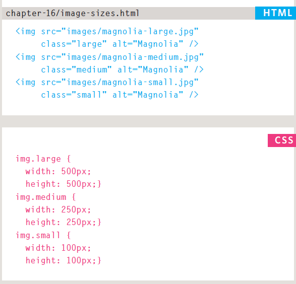

## AligNi ng images Using CSS

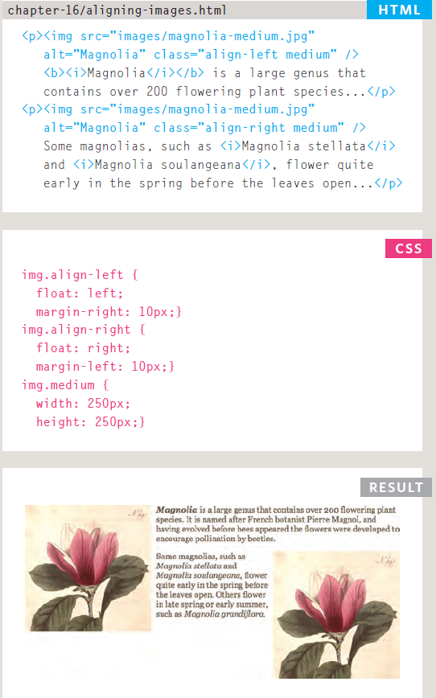

## Centering images Using CSS
By default, images are inline elements. This means that they flow within the surrounding text.In order to center an image, it should be turned into a block level element using the display property with a value of block.

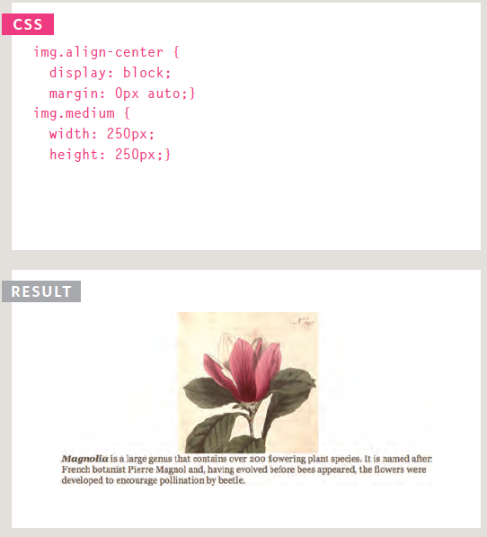

## Background Images 

The background-image property allows you to place an image behind any HTML element. This could be the entire page or just part of the page. By default, a background image will repeat to fill the entire box.

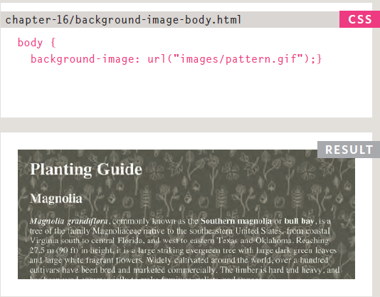

## Repeating Images
background-repeat
background-attachment
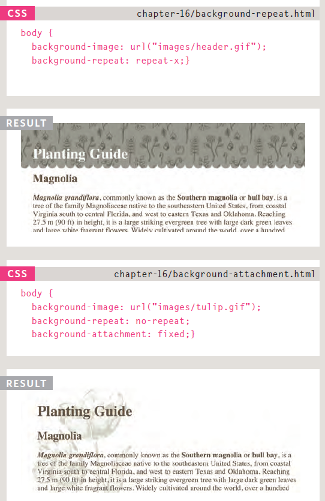

## Background Position
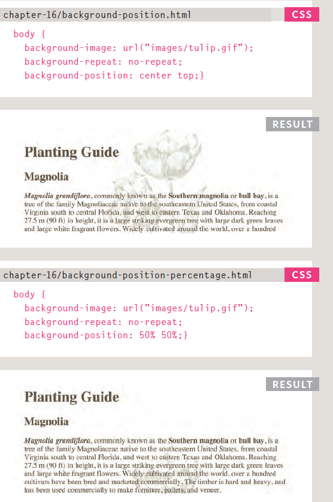
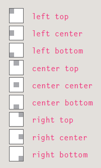

## shorthand background
The background property acts like a shorthand for all of the other background properties you have just seen, and also the background-color property.
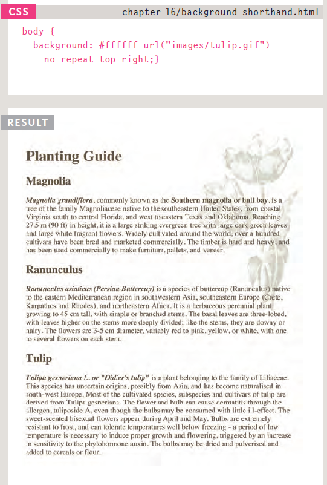

## Image Rollovers & Sprites

Using CSS, it is possible to create a link or button that changes to a second style when a user moves the mouse over it (known as a rollover) and a third style when they click on it.

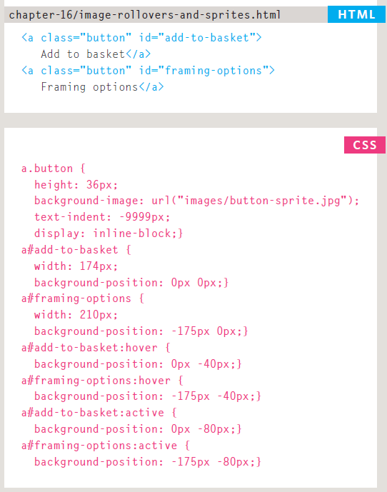
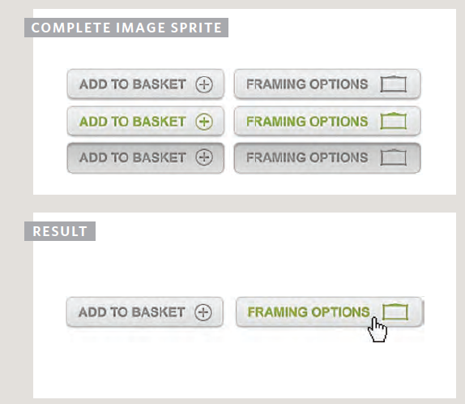

## CSS3  : Gradients background-image

CSS3 is going to introduce the ability to specify a gradient for the background of a box. The gradient is created using the background-image property and, at the time of writing, different browsers required a different syntax.
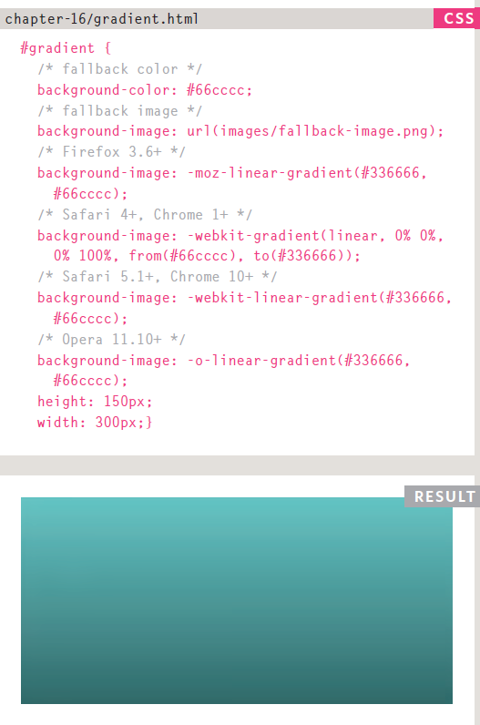

## Contrast of background images
If you want to overlay text on a background image, the image must be low contrast in order for the text to be legible.

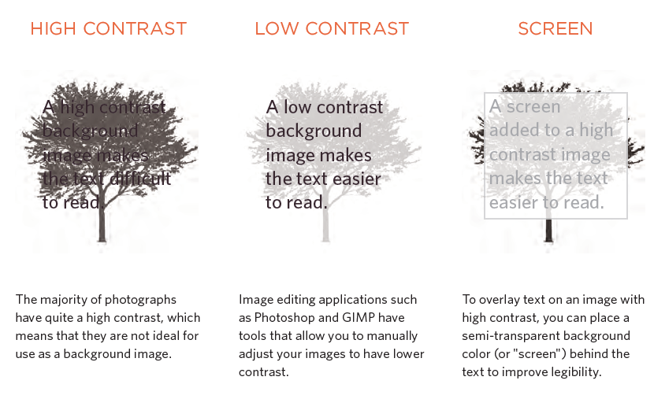

# Practical Information

## Search Engine Optimization (SEO )

SEO is a huge topic and several books have been written on the subject. The following pages will help you understand the key concepts so you can improve your website's visibility on search engines.

* The Basics 
Search engine optimization (or SEO) is the practice of trying to help your site appear nearer the top of search engine results when people look for the topics that your website covers.

* On-Page Techniques
On-page techniques are the methods you can use on your web pages to improve their rating in search engines.

* Off-Page Techniques 
Getting other sites to link to you is just as important as on-page techniques. Search engines help determine how to rank your site by looking at the number of other sites that link to yours.

## On-Page SEO

In every page of your website there are seven key places where keywords (the words people might search on to find your site) can appear in order to improve its findability.

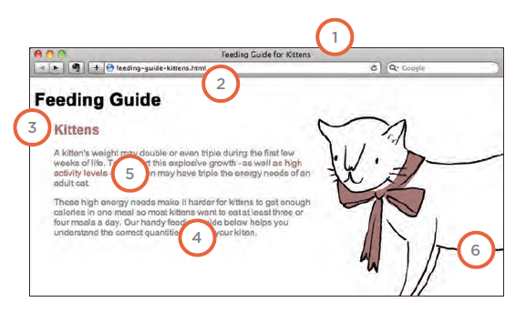

1. Page Title
2. URL / Web Address
3. Headings
4. Text
5. Link Text
6. Image Alt Text
7. Page Descriptions

## How to Identify Keywords and Phrases
Determining which keywords to use on your site can be one of the hardest tasks when you start to think about SEO. Here are six steps that will help you identify the right keywords and phrases for your site.

1. Brainstorm : List down the words that someone might type into Google to find your site. Be sure to include the various topics, products or services your site is about.

2. Organize : Group the keywords into separate lists for the different sections or categories of your website.

3. Research : There are several tools that let you enter your keywords and then they will suggest additional keywords you might like to consider

4. Compare : It is very unlikely that your site will appear at the top of the search results for every keyword. This is especially true for topics where there is a lot of competition. The more sites out there that have already been optimized for a given keyword, the harder it will be for you to rise up the search results when people search on that term.

5. Refine : Now you need to pick which keywords you will focus on. These should always be the ones that are most relevant to each section of your site.

6. Map : Now that you have a refined list of keywords, you know which have the most competition, and
which ones are most relevant, it is time to start picking which keywords you will use for each page.

## Analytics: Learning about your Visitors
As soon as people start coming to your site, you can start analyzing how they found it, what they were looking at and at what point they are leaving. One of the best tools for doing this is a free service offered by Google called Google Analytics.

## How Many People Are Coming to Your Site?
The overview page gives you a snapshot of the key information you are likely to want to know. In particular, it tells you how many people are coming to your site.

#### * Visits
This is the number of times people have come to your site. If someone is inactive on your site
for 30 minutes and then looks at another page on your site, it will be counted as a new visit.

#### * Unique Visits
This is the total number of people who have visited your site over the specified period. The number of unique visits will be lower than the number of visits if people have been returning to your site more than once in the defined period.

#### * Page Views
The total number of pages all visitors have viewed on your site.

#### * Pages per Visit
The average number of pages each visitor has looked at on your site per visit.

#### * Av erage Time on Site
The average amount of time each user has spent on the site per visit.

#### * Date Selector
Using the date selector in the top right hand corner of the site, you can change the period of time the reports display. When you log in, this is usually set to the last month, but you can change it to report on a specific time period.
#### * Export
The export link just above the title that says "visitors overview" allows you to export the statistics on this page for other applications such as Excel.

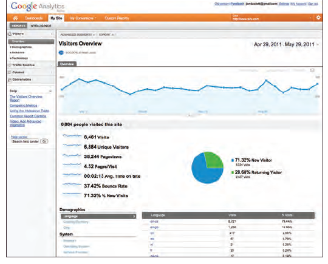

## What Are Your Visitors Looking At?
The content link on the left-hand side allows you to learn more about what the visitors are looking at when they come to your site.

#### * Pages
This tells you which pages your visitors are looking at the most and also which pages they are spending the most time on.

#### * Landing Pages
These are the pages that people arrive on when first visiting your site. This can be particularly helpful because you may find people are not always coming into your site via the homepage

#### * Top Exit Pages
This shows which pages people most commonly leave from. If a lot of people are leaving from he same page then you might consider changing that page or improving it.

#### * Bounce Rate
This shows the number of people who left on the same page that they arrived on. A high bounce rate suggests that the content is not what they were looking for or that the page did not sufficiently encourage them to look around the rest of the site. What counts as a bounce:
1.  Clicked a link to another site
2.  Clicked on an advertisement
3.  Entered a new URL
4.  Used the "back" button
5.  Closed the browser

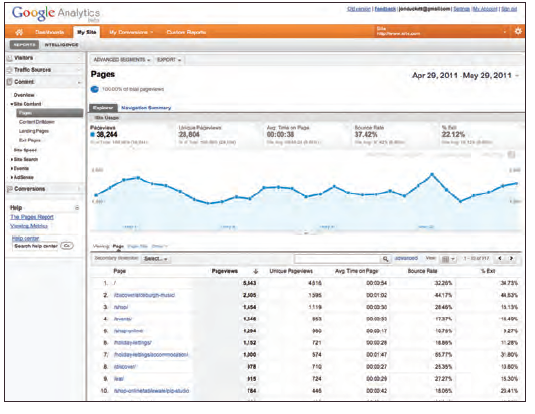

## Where Are Your Visitors Coming From?
The traffic sources link on the left hand side allows you to learn where your visitors are coming from.

#### * Referrers
This shows the sites that have linked to you and the number of people who have come via those sites. If a site sends a lot of traffic to you, get in touch and try to work together to ensure that traffic keeps flowing. You could also try to find similar sites and ask them to link to you.

#### * Direct
This shows which page a user arrived on if they did not come via a link on another site. They might have typed the URL into their browser, used a browser bookmark, or clicked a link in an email, PDF, or Word document.

#### * Search Terms
This shows the terms users entered into a search engine to find your site. This can help you learn how visitors describe what they're looking for (which is often different to how someone might describe their own site). This can help you fine-tune your content and your SEO keywords.

#### * Advanced Features
We have only scratched the surface of what you can find out about your visitors from Google Analytics. Their help files tell you many more of the advanced features. If you run an online shop, it is well worth looking at their e-commerce tracking, which adds information about products sold, average basket size and much more. You can also set up goals where you specify the paths you want people to take, and then see how far they get through those paths, which is especially useful when gathering data from users.

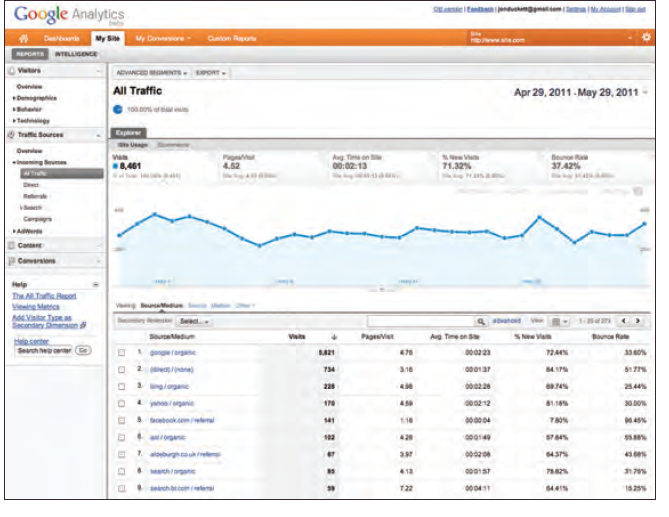

## Domain Names & Hosting

In order to put your site on the web you will need a domain name and web hosting.

### Domain Name 
Your domain name is your web address (e.g. google.com or bbc. co.uk). There are many websites that allow you to register domain names. Usually you will have to pay an annual fee to keep that domain name.

### WEB Hosting
So that other people can see your site, you will need to upload it to a web server. Web servers are special computers that are constantly connected to the Internet. They are specially set up to serve web pages when they are requested.

There are lots of different types of hosting on offer. We will now take a look at some of the key things that will help you choose which hosting company to use.

1. Disk space
2. Bandwidth
3. Backups
4. Email accounts
5. Server-side languages and databases

### Hosted Services 
There are a number of online services that allow you to point your domain name to their servers

## FTP & Third Party Tools

To transfer your code and images from your computer to your hosting company, you use something known as File Transfer Protocol.

There are a wide variety of sites that offer services commonly created by web developers (to save you having to build them yourself).

#### Here is a list of some popular FTP applications:

1. FileZilla
2. FireFTP
3. CuteFTP
4. SmartFTP
5. Transmit

#### Here is a list of some popular third party tools:
1. Blogs
2. E-commerce
3. Email newsletters
4. Social networking sharing buttons

