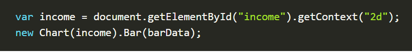

## CHART.JS
Charts are far better for displaying data visually than tables and have the added benefit that no one is ever going to press-gang them into use as a layout tool.

It's easy to get started with Chart.js. All that's required is the script included in your page along with a single canvas node to render the chart.

## Setting up

The first thing we need to do is download Chart.js. Copy the Chart.min.js out of the unzipped folder and into the directory you’ll be working in. Then create a new html page and import the script:

## Drawing a line chart
To draw a line chart, the first thing we need to do is create a canvas element in our HTML in which Chart.js can draw our chart. So add this to the body of our HTML page:

Inside the same script tags we need to create our data, in this instance it’s an object that contains labels for the base of our chart and datasets to describe the values on the chart. Add this immediately above the line that begins ‘var buyers=’:

## Drawing a pie chart
Our line chart is complete, so let’s move on to our pie chart. First, we need the canvas element:

Next, we need to get the context and to instantiate the chart:

Next we need to create the data. This data is a little different to the line chart because the pie chart is simpler, we just need to supply a value and a color for each section:

Now, immediately after the pieData we’ll add our options:

These options do two things, first they remove the stroke from the segments, and then they animate the scale of the pie so that it zooms out from nothing.

## Drawing a bar chart

First, we add the canvas element:

Next, we retrieve the element and create the graph:

And finally, we add in the bar chart’s data:

## The canvas element

## Applying styles and colors

### Colors
Up until now we have only seen methods of the drawing context. If we want to apply colors to a shape, there are two important properties we can use: fillStyle and strokeStyle

### A fillStyle example

### A strokeStyle example

## Transparency

In addition to drawing opaque shapes to the canvas, we can also draw semi-transparent (or translucent) shapes. This is done by either setting the globalAlpha property or by assigning a semi-transparent color to the stroke and/or fill style.

The globalAlpha property can be useful if you want to draw a lot of shapes on the canvas with similar transparency, but otherwise it's generally more useful to set the transparency on individual shapes when setting their colors.

Because the strokeStyle and fillStyle properties accept CSS rgba color values, we can use the following notation to assign a transparent color to them.

ctx.strokeStyle = 'rgba(255, 0, 0, 0.5)';

ctx.fillStyle = 'rgba(255, 0, 0, 0.5)';

## Drawing text 
The canvas rendering context provides two methods to render text:

1. fillText(text, x, y [, maxWidth])

2. strokeText(text, x, y [, maxWidth])

## A fillText example

## A strokeText example

