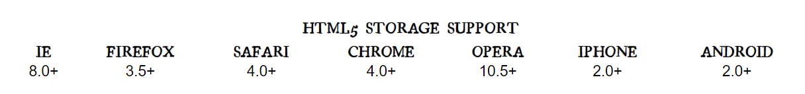
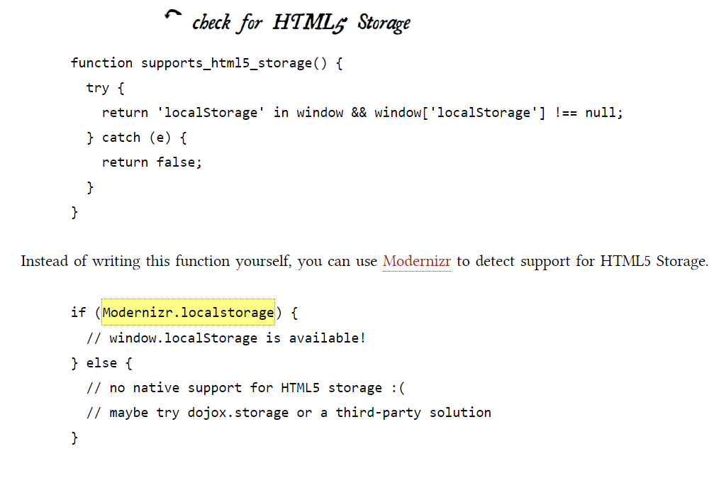
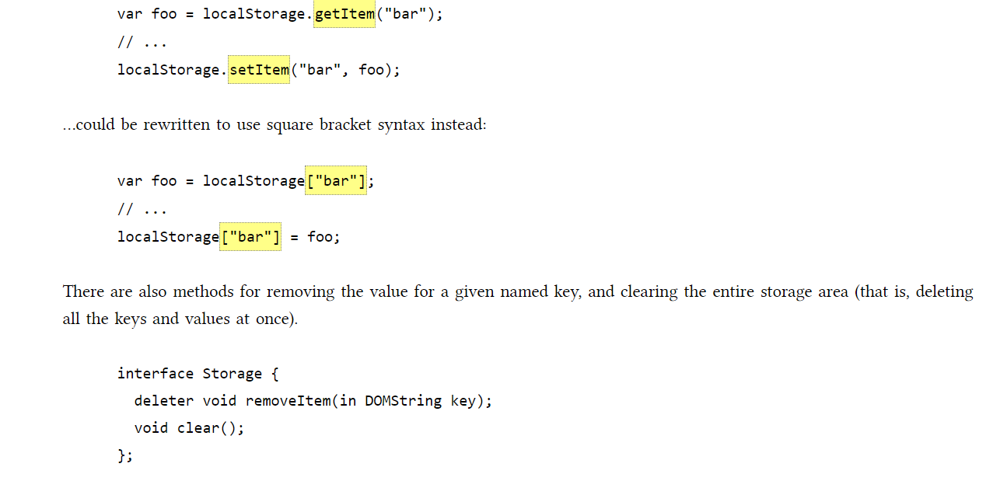
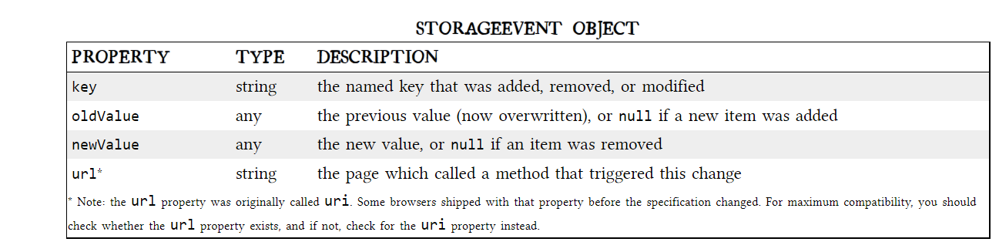
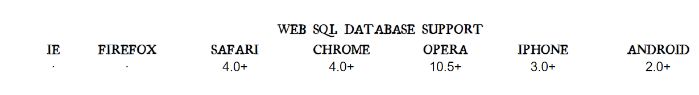

## THE PAST, PRESENT & FUTURE OF LOCAL STORAGE FOR WEB APPLICATIONS

### DIVING IN

persistent local storage is one of the areas where native client applications have held an advantage over web applications. For native applications, the operating system typically provides an abstraction layer for storing and retrieving application-specific data like preferences or runtime state.

Historically, web applications have had none of these luxuries. Cookies were invented early in the web’s history, and indeed they can be used for persistent local storage of small amounts of data. But they have three potentially dealbreaking downsides:

1. Cookies are included with every HTTP request, thereby slowing down your web application by needlessly transmitting the same data over and over
2. Cookies are included with every HTTP request, thereby sending data unencrypted over the internet (unless your entire web application is served over SSL)
3. Cookies are limited to about 4 KB of data — enough to slow down your application (see above), but not enough to be terribly useful

What we really want is:

* a lot of storage space
* on the client
* that persists beyond a page refresh
* and isn’t transmitted to the server

### A BRIEF HISTORY OF LOCAL STORAGE HACKS BEFORE HTML5

there was only Internet Explorer. Or at least, that’s what Microsoft wanted the world to think. To that end, as part of the First Great Browser Wars, Microsoft invented a great many things and included them in their browser-to-end-all-browser-wars, Internet Explorer. One of these things was called DHTML Behaviors, and one of these behaviors was called userData.

### INTRODUCING HTML5 STORAGE

What I will refer to as “HTML5 Storage” is a specification named Web Storage, which was at one time part of the HTML5 specification proper, but was split out into its own specification for uninteresting political reasons. Certain browser vendors also refer to it as “Local Storage” or “DOM Storage.” 

### HTML5 STORAGE SUPPORT

From your JavaScript code, you’ll access HTML5 Storage through the localStorage object on the global window object. Before you can use it, you should detect whether the browser supports it.

### USING HTML5 STORAGE

HTML5 Storage is based on named key/value pairs. You store data based on a named key, then you can retrieve that data with the same key. The named key is a string. The data can be any type supported by JavaScript, including strings, Booleans, integers, or floats. However, the data is actually stored as a string. If you are storing and retrieving anything other than strings, you will need to use functions like parseInt() or parseFloat() to coerce your retrieved data into the expected JavaScript datatype.

interface Storage {

  getter any getItem(in DOMString key);

  setter creator void setItem(in DOMString key, in any data);

};

Calling setItem() with a named key that already exists will silently overwrite the previous value. Calling getItem() with a non-existent key will return null rather than throw an exception.

Like other JavaScript objects, you can treat the localStorage object as an associative array. Instead of using the getItem() and setItem() methods, you can simply use square brackets. For example, this snippet of code:

Calling removeItem() with a non-existent key will do nothing.

Finally, there is a property to get the total number of values in the storage area, and to iterate through all of the keys by index (to get the name of each key).

interface Storage {

  readonly attribute unsigned long length;

  getter DOMString key(in unsigned long index);

};

If you call key() with an index that is not between 0–(length-1), the function will return null.

### TRACKING CHANGES TO THE HTML5 STORAGE AREA

If you want to keep track programmatically of when the storage area changes, you can trap the storage event. The storage event is fired on the window object whenever setItem(), removeItem(), or clear() is called and actually changes something. For example, if you set an item to its existing value or call clear() when there are no named keys, the storage event will not fire, because nothing actually changed in the storage area.

### LIMITATIONS IN CURRENT BROWSERS

In talking about the history of local storage hacks using third-party plugins, I made a point of mentioning the limitations of each technique, such as storage limits. I just realized that I haven’t mentioned anything about the limitations of the now-standardized HTML5 Storage. I’ll give you the answers first, then explain them. The answers, in order of importance, are “5 megabytes,” “QUOTA_EXCEEDED_ERR,” and “no.”
“5 megabytes” is how much storage space each origin gets by default. 

“QUOTA_EXCEEDED_ERR” is the exception that will get thrown if you exceed your storage quota of 5 megabytes. “No” is the answer to the next obvious question.

### HTML5 STORAGE IN ACTION

Let’s see HTML5 Storage in action [Recall the Halma game we constructed in the canvas chapter](http://diveinto.html5doctor.com/canvas.html#halma) . . There’s a small problem with the game: if you close the browser window mid-game, you’ll lose your progress. But with HTML5 Storage, we can save the progress locally, within the browser itself. Here is a live demonstration. Make a few moves, then close the browser tab, then re-open it. If your browser supports HTML5 Storage, the demonstration page should magically remember your exact position within the game, including the number of moves you’ve made, the position of each of the pieces on the board, and even whether a particular piece is selected.

How does it work? Every time a change occurs within the game, we call this function:

function saveGameState() {

    if (!supportsLocalStorage()) { return false; }

    localStorage["halma.game.in.progress"] = gGameInProgress;

    for (var i = 0; i < kNumPieces; i++) {

	localStorage["halma.piece." + i + ".row"] = gPieces[i].row;

	localStorage["halma.piece." + i + ".column"] = gPieces[i].column;

    }

    localStorage["halma.selectedpiece"] = gSelectedPieceIndex;

    localStorage["halma.selectedpiecehasmoved"] = gSelectedPieceHasMoved;

    localStorage["halma.movecount"] = gMoveCount;

    return true;

}
As you can see, it uses the localStorage object to save whether there is a game in progress (gGameInProgress, a Boolean). If so, it iterates through the pieces (gPieces, a JavaScript Array) and saves the row and column number of each piece. Then it saves some additional game state, including which piece is selected (gSelectedPieceIndex, an integer), whether the piece is in the middle of a potentially long series of hops (gSelectedPieceHasMoved, a Boolean), and the total number of moves made so far (gMoveCount, an integer).

On page load, instead of automatically calling a newGame() function that would reset these variables to hard-coded values, we call a resumeGame() function instead. Using HTML5 Storage, the resumeGame() function checks whether a state about a game-in-progress is stored locally. If so, it restores those values using the localStorage object.

function resumeGame() {

    if (!supportsLocalStorage()) { return false; }

    gGameInProgress = (localStorage["halma.game.in.progress"] == "true");

    if (!gGameInProgress) { return false; }

    gPieces = new Array(kNumPieces);

    for (var i = 0; i < kNumPieces; i++) {

	var row = parseInt(localStorage["halma.piece." + i + ".row"]);

	var column = parseInt(localStorage["halma.piece." + i + ".column"]);

	gPieces[i] = new Cell(row, column);

    }
    gNumPieces = kNumPieces;

    gSelectedPieceIndex = parseInt(localStorage["halma.selectedpiece"]);

    gSelectedPieceHasMoved = localStorage["halma.selectedpiecehasmoved"] == "true";

    gMoveCount = parseInt(localStorage["halma.movecount"]);

    drawBoard();

    return true;
}
The most important part of this function is the caveat that I mentioned earlier in this chapter, which I’ll repeat here: Data is stored as strings. If you are storing something other than a string, you’ll need to coerce it yourself when you retrieve it. For example, the flag for whether there is a game in progress (gGameInProgress) is a Boolean. In the saveGameState() function, we just stored it and didn’t worry about the datatype:

localStorage["halma.game.in.progress"] = gGameInProgress;
But in the resumeGame() function, we need to treat the value we got from the local storage area as a string and manually construct the proper Boolean value ourselves:

gGameInProgress = (localStorage["halma.game.in.progress"] == "true");
Similarly, the number of moves is stored in gMoveCount as an integer. In the saveGameState() function, we just stored it:

localStorage["halma.movecount"] = gMoveCount;
But in the resumeGame() function, we need to coerce the value to an integer, using the parseInt() function built into JavaScript:

gMoveCount = parseInt(localStorage["halma.movecount"]);

### BEYOND NAMED KEY-VALUE PAIRS: COMPETING VISIONS

While the past is littered with hacks and workarounds, the present condition of HTML5 Storage is surprisingly rosy. A new API has been standardized and implemented across all major browsers, platforms, and devices. As a web developer, that’s just not something you see every day, is it? But there is more to life than “5 megabytes of named key/value pairs,” and the future of persistent local storage is… how shall I put it… well, there are competing visions.

