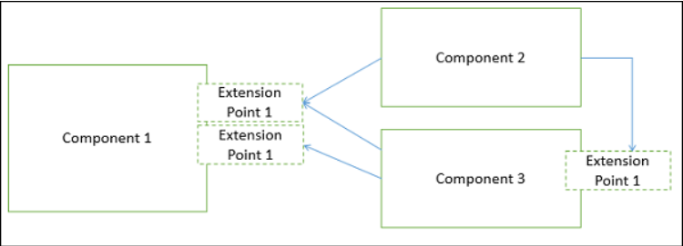
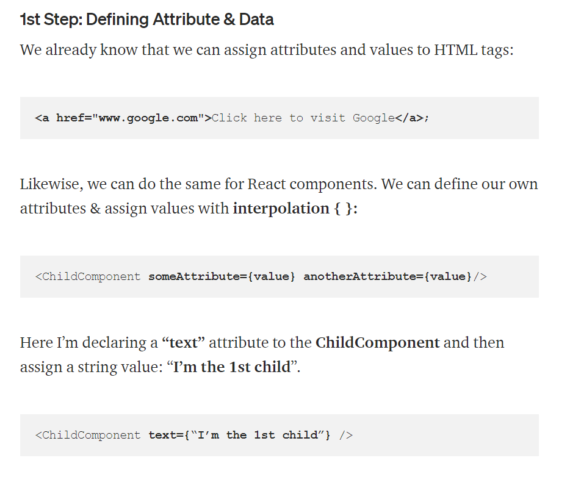
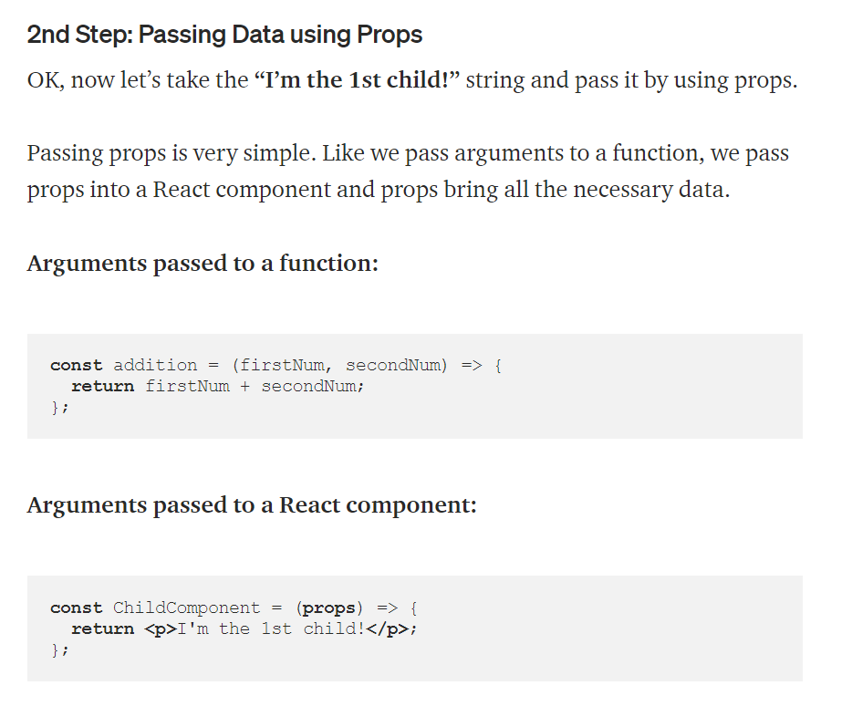
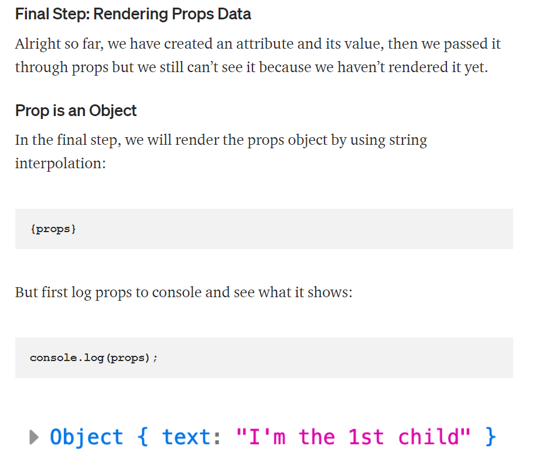
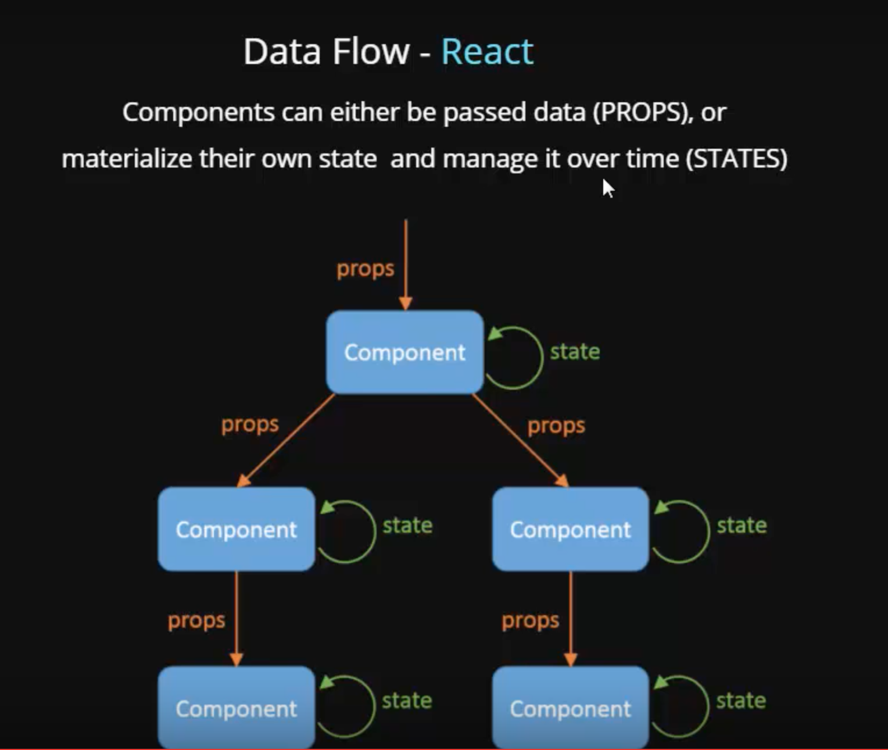

## component

### What is a component?

* A component is a modular, portable, replaceable, and reusable set of well-defined functionality that encapsulates its implementation and exporting it as a higher-level interface.

* A component is a software object, intended to interact with other components, encapsulating certain functionality or a set of functionalities. It has an obviously defined interface and conforms to a recommended behavior common to all components within an architecture.

* A software component can be defined as a unit of composition with a contractually specified interface and explicit context dependencies only. That is, a software component can be deployed independently and is subject to composition by third parties.

### Views of a Component :

1. Object-oriented view
2. Conventional view
3. Process-related view :

 In this view, instead of creating each component from scratch, the system is building from existing components maintained in a library. As the software architecture is formulated, components are selected from the library and used to populate the architecture.

* A user interface (UI) component includes grids, buttons referred as controls, and utility components expose a specific subset of functions used in other components.

* Other common types of components are those that are resource intensive, not frequently accessed, and must be activated using the just-in-time (JIT) approach.

* Many components are invisible which are distributed in enterprise business applications and internet web applications such as Enterprise JavaBean (EJB), .NET components, and CORBA components.

### What are the charactistics of a component?

1. Reusability − Components are usually designed to be reused in different situations in different applications. However, some components may be designed for a specific task.

2. Replaceable − Components may be freely substituted with other similar components.

3. Not context specific − Components are designed to operate in different environments and contexts.

4. Extensible − A component can be extended from existing components to provide new behavior.

5. Encapsulated − A A component depicts the interfaces, which allow the caller to use its functionality, and do not expose details of the internal processes or any internal variables or state.

6. Independent − Components are designed to have minimal dependencies on other components.

### Principles of Component−Based Design

### What are the advantages of using component based architecture?

1. Ease of deployment − As new compatible versions become available, it is easier to replace existing versions with no impact on the other components or the system as a whole.

2. Reduced cost − The use of third-party components allows you to spread the cost of development and maintenance.

3. Ease of development − Components implement well-known interfaces to provide defined functionality, allowing development without impacting other parts of the system.

4. Reusable − The use of reusable components means that they can be used to spread the development and maintenance cost across several applications or systems.

5. Modification of technical complexity − A component modifies the complexity through the use of a component container and its services.

6. Reliability − The overall system reliability increases since the reliability of each individual component enhances the reliability of the whole system via reuse.

7. System maintenance and evolution − Easy to change and update the implementation without affecting the rest of the system.

8. Independent − Independency and flexible connectivity of components. Independent development of components by different group in parallel. Productivity for the software development and future software development.

## Props in React

### What is props short for?

Object in construction function but we use props in class ensted the normal object.

### How are props used in React?

I will be explaining how to use Props step by step.

* Firstly, define an attribute and its value(data)
* Then pass it to child component(s) by using Props
* Finally, render the Props Data

<!-- referance https://medium.com/@kenlynterai/data-handling-in-reactjs-c53f66b45309 -->
### What is the flow of props?

