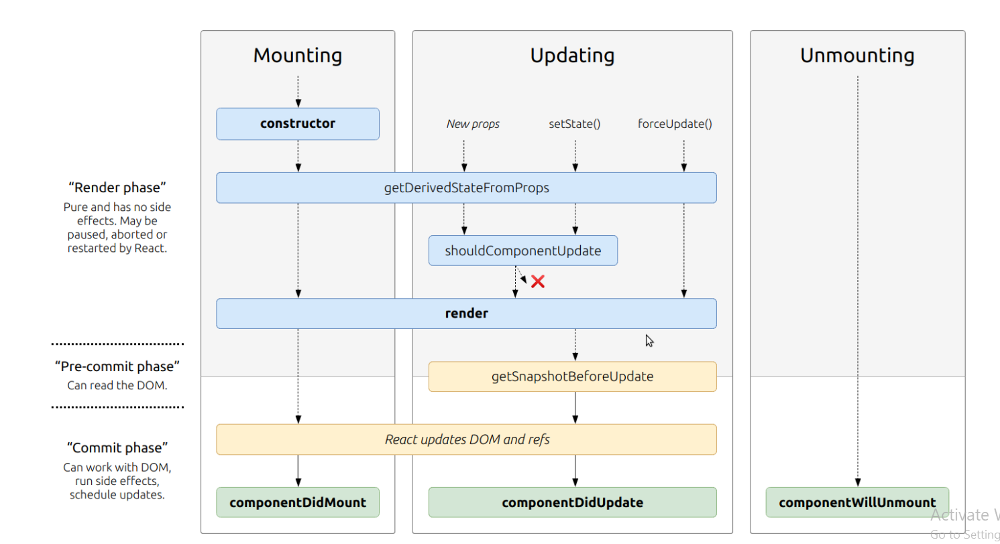
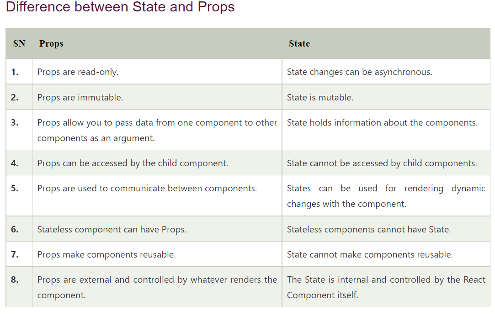

## React

### React: Component Lifecycle Events

### Based off the diagram, what happens first, the ‘render’ or the ‘componentDidMount’?

#### render then componentDidMount

### What is the very first thing to happen in the lifecycle of React?

### What is the very first thing to happen in the lifecycle of React?

#### Mounting

### Put the following things in the order that they happen: componentDidMount, render, constructor, componentWillUnmount, React Updates.

#### constructor , render ,  React Updates ,componentDidMount, componentWillUnmount .

### What does componentDidMount do?

 This method is invoked immediately after a component is mounted. If you need to load anything using a network request or initialize the DOM, it should go here. This method is a good place to set up any subscriptions. If you do that, don’t forget to unsubscribe in componentWillUnmount().

setState() can be called here, but it should be used sparingly, because it will cause a rerender, which can lead to perfomance issues.

Here we use componentDidMount() to connect to the YouTube API and get videos when the components is rendered.

componentDidMount()

 {

console.log(‘got videos’);

this.getVideos(‘cats’);

}

getVideos(query) {

var options = {

key: this.props.YOUTUBE_API_KEY,

query: query

};

<!-- /www.javatpoint.com -->
### React State Vs Props

### What is the big difference between props and state?

props update outside the component
state update inside the component

### When do we re-render our application?
when we use state

### What are some examples of things that we could store in state?
counter , form information , checkbox

