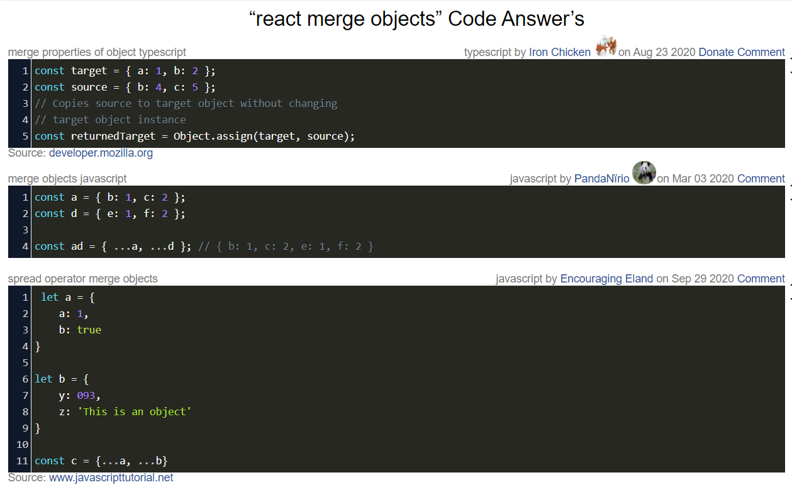

## Lists and Keys
<!-- https://developer.mozilla.org -->
### What does .map() return?

The map() method creates a new array populated with the results of calling a provided function on every element in the calling array.

### If I want to loop through an array and display each value in JSX, how do I do that in React?

by using map and Key

### Each list item needs a unique ____.

Key
<!-- https://developer.mozilla.org/ -->
### What is the purpose of a key?

The Object.keys() method returns an array of a given object's own enumerable property names, iterated in the same order that a normal loop would.

##
<!-- https://www.educative.io/ -->
### What is the spread operator?
The spread operator is a new addition to the set of operators in JavaScript ES6. It takes in an iterable (e.g an array) and expands it into individual elements.

The spread operator is commonly used to make shallow copies of JS objects. Using this operator makes the code concise and enhances its readability.

<!-- https://www.educative.io/  & https://medium.com/-->

### List 4 things that the spread operator can do?
1.Copying an array
2.Inserting the elements of one array into another
3.Array to arguments
4.Converting NodeList to an array.
<!-- https://www.codegrepper.com/ -->
### Give an example of using the spread operator to combine two arrays?

<!-- https://stackoverflow.com/ -->
### Give an example of using the spread operator to add a new item to an array?

<!-- https://www.codegrepper.com/ -->

### Give an example of using the spread operator to combine two objects into one?

### In the video, what is the first step that the developer does to pass functions between components?

passed all object elemant into a new array when the botton clecked to he can change the counter 

### In your own words, what does the increment function do?

<!-- https://medium.com/ -->
### How can you pass a method from a parent component into a child component?

1. Create a child component and put the below code inside that component.
2.  Now we will import the child component to our parent component.
3.  Then inside your parent function create another function to run our desire event and pass the child component to return.
<!-- https://reactgo.com/ -->
### How does the child component invoke a method that was passed to it from a parent component?

