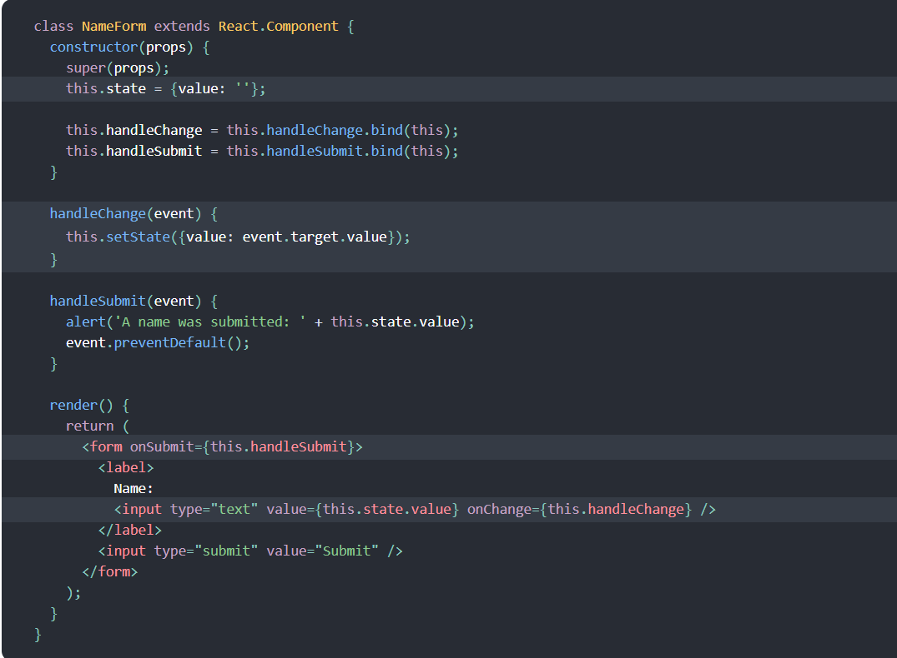

## Forms

### What is a ‘Controlled Component’?

In HTML, form elements such as input, textarea, and select typically maintain their own state and update it based on user input. In React, mutable state is typically kept in the state property of components, and only updated with setState().

We can combine the two by making the React state be the “single source of truth”. Then the React component that renders a form also controls what happens in that form on subsequent user input. An input form element whose value is controlled by React in this way is called a “controlled component”.

### Should we wait to store the users responses from the form into state when they submit the form OR should we update the state with their responses as soon as they enter them? Why. no we shpudnt 

 no we shouldn't,  Since the value attribute is set on our form element, the displayed value will always be this.state.value, making the React state the source of truth. Since handleChange runs on every keystroke to update the React state, the displayed value will update as the user types.
 
 ### How do we target what the user is entering if we have an event handler on an input field?

 

### Why would we use a ternary operator?

to write the code faster 

 ### Rewrite the following statement using a ternary statement:
  if(x===y){

 console.log(true);

  } else {

 console.log(false);

  }

  ### let value = (x===y)?'true ' : 'false' ;

### console.log(value)

