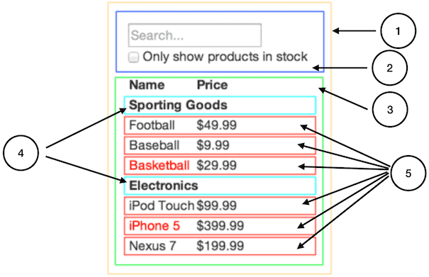

### How would you break a mock into a component heirarchy?

The first thing you’ll want to do is to draw boxes around every component (and subcomponent) in the mock and give them all names. If you’re working with a designer, they may have already done this, so go talk to them! Their Photoshop layer names may end up being the names of your React components!

### What is the single responsibility principle and how does it apply to components?

that is, a component should ideally only do one thing. If it ends up growing, it should be decomposed into smaller subcomponents.
Since you’re often displaying a JSON data model to a user, you’ll find that if your model was built correctly, your UI (and therefore your component structure) will map nicely. That’s because UI and data models tend to adhere to the same information architecture. Separate your UI into components, where each component matches one piece of your data model.
 

### What does it mean to build a ‘static’ version of your application?

Now that you have your component hierarchy,
 it’s time to implement your app.
 The easiest way is to build a version that takes your data model and renders the UI but has no interactivity. It’s best to decouple these processes because building a static version requires a lot of typing and no thinking, and adding interactivity requires a lot of thinking and not a lot of typing. 

### Once you have a static application, what do you need to add?

Add Inverse Data Flow

### What are the three questions you can ask to determine if something is state?

Is it passed in from a parent via props? If so, it probably isn’t state.
Does it remain unchanged over time? If so, it probably isn’t state.
Can you compute it based on any other state or props in your component? If so, it isn’t state.

### How can you identify where state needs to live?

Identify every component that renders something based on that state.
Find a common owner component (a single component above all the components that need the state in the hierarchy).
Either the common owner or another component higher up in the hierarchy should own the state.

