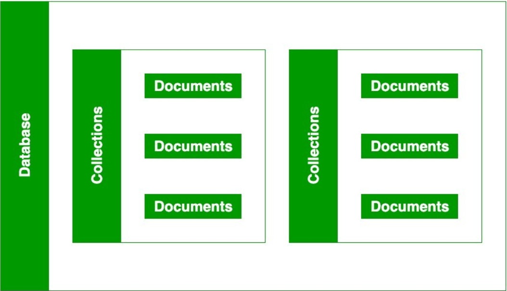

<!-- https://www.mongodb.com/nosql-explained/nosql-vs-sql -->

|    |  SQL |NoSQL    |                  
|-----------------|:------------|-----------------| 
| Data Storage Model    | Tables with fixed rows and columns | Document: JSON documents, Key-value: key-value pairs, Wide-column: tables with rows and dynamic columns, Graph: nodes and edges    |
| Development History     | Developed in the 1970s with a focus on reducing data duplication | Developed in the late 2000s with a focus on scaling and allowing for rapid application change driven by agile and DevOps practices.     |
| Examples    | Oracle, MySQL, Microsoft SQL Server, and PostgreSQL | Document: MongoDB and CouchDB, Key-value: Redis and DynamoDB, Wide-column: Cassandra and HBase, Graph: Neo4j and Amazon Neptune     |
| Primary Purpose    | General purpose| Document: general purpose, Key-value: large amounts of data with simple lookup queries, Wide-column: large amounts of data with predictable query patterns, Graph: analyzing and traversing relationships between connected data      |
| Schemas     | Rigid |  Flexible  |
| Scaling     | Vertical (scale-up with a larger server) | Horizontal (scale-out across commodity servers)     |
| Multi-Record ACID Transactions     | Supported | Most do not support multi-record ACID transactions. However, some—like MongoDB—do.     |
| Joins     | Typically required | Typically not required     |
| Data to Object Mapping     | Requires ORM (object-relational mapping) | Many do not require ORMs. MongoDB documents map directly to data structures in most popular programming languages.     |

### What kind of data is a good fit for an SQL database?

1. MySQL Community Edition
2. MS-SQL Server Express Edition
3. Oracle Express Edition

### Give a real world example.

Replication: By replicating MySQL database across multiple nodes the work load can be reduced heavily increasing the scalability and availability of business application

### What kind of data is a good fit a NoSQL database?

1. MongoDB
2. CouchDB
3. Redis

### Give a real world example.

Speed: For simple queries, it gives good performance, as all the related data are in single document which eliminates the join operations.

### Which type of database is best for hierarchical data storage?

NoSQL database fits better for the hierarchical data storage

### Which type of database is best for scalability?

For scalability: In most typical situations, SQL databases are vertically scalable.

<!-- from internet -->

### What does SQL stand for?

 stands for Structured Query Language. SQL is used to communicate with a database. According to ANSI (American National Standards Institute), it is the standard language for relational database management systems.

### What is a realational database?

A relational database is a type of database that stores and provides access to data points that are related to one another. Relational databases are based on the relational model, an intuitive, straightforward way of representing data in tables. In a relational database, each row in the table is a record with a unique ID called the key. The columns of the table hold attributes of the data, and each record usually has a value for each attribute, making it easy to establish the relationships among data points.

### What type of structure does a relational database work with?

The relational model means that the logical data structures—the data tables, views, and indexes—are separate from the physical storage structures. This separation means that database administrators can manage physical data storage without affecting access to that data as a logical structure. For example, renaming a database file does not rename the tables stored within it.

The distinction between logical and physical also applies to database operations, which are clearly defined actions that enable applications to manipulate the data and structures of the database. Logical operations allow an application to specify the content it needs, and physical operations determine how that data should be accessed and then carries out the task.

To ensure that data is always accurate and accessible, relational databases follow certain integrity rules. For example, an integrity rule can specify that duplicate rows are not allowed in a table in order to eliminate the potential for erroneous information entering the database.

### What is a ‘schema’?

The database schema is its structure described in a formal language supported by the database management system (DBMS). The term "schema" refers to the organization of data as a blueprint of how the database is constructed (divided into database tables in the case of relational databases). The formal definition of a database schema is a set of formulas (sentences) called integrity constraints imposed on a database.[citation needed] These integrity constraints ensure compatibility between parts of the schema. All constraints are expressible in the same language. A database can be considered a structure in realization of the database language.The states of a created conceptual schema are transformed into an explicit mapping, the database schema. This describes how real-world entities are modeled in the database.

### What is a NoSQL database?

When people use the term “NoSQL database”, they typically use it to refer to any non-relational database. Some say the term “NoSQL” stands for “non SQL” while others say it stands for “not only SQL.” Either way, most agree that NoSQL databases are databases that store data in a format other than relational tables.

### Howo does it work?

One way of understanding the appeal of NoSQL databases from a design perspective is to look at how the data models of a SQL and a NoSQL database might look in an oversimplified example using address data.

The SQL Case. For an SQL database, setting up a database for addresses begins with the logical construction of the format and the expectation that the records to be stored are going to remain relatively unchanged. After analyzing the expected query patterns, an SQL database might optimize storage in two tables, one for basic information and one pertaining to being a customer, with last name being the key to both tables. Each row in each table is a single customer, and each column has the following fixed attributes:

Last name :: first name :: middle initial :: address fields :: email address :: phone number
Last name :: date of birth :: account number :: customer years :: communication preferences
The NoSQL Case. In the section Types of NoSQL Databases above, there were four types described, and each has its own data model.

Each type of NoSQL database would be designed with a specific customer situation in mind, and there would be technical reasons for how each kind of database would be organized. The simplest type to describe is the document database, in which it would be natural to combine both the basic information and the customer information in one JSON document. In this case, each of the SQL column attributes would be fields and the details of a customer’s record would be the data values associated with each field.

For example: Last_name: "Jones", First_name: "Mary", Middle_initial: "S", etc

### What is inside of a Mongo database?

 

### Which is more flexible - SQL or MongoDB? and why.

MongoDB

MongoDB documents consist of a series of key/value pairs of varying types, including arrays and nested documents; however, the key difference is that the structure of the key/value pairs in a given collection can vary from document to document. This more flexible approach is possible because documents are self-describing.

### What is the disadvantage of a NoSQL database?

* NoSQL databases don’t have the reliability functions which Relational Databases have (basically don’t support ACID).
* This also means that NoSQL databases offer consistency in performance and scalability.
* In order to support ACID developers will have to implement their own code, making their systems more complex.
* This may reduce the number of safe applications that commit transactions, for example bank systems.
* NoSQL is not compatible (at all) with SQL.
* Note: Some NoSQL management systems do use a Structured Query Language.
* This means that you will need a manual query language, making things slower and more complex.
* NoSQL are very new compared to Relational Databases, which means that are far less stable and may have a lot less functionalities.

