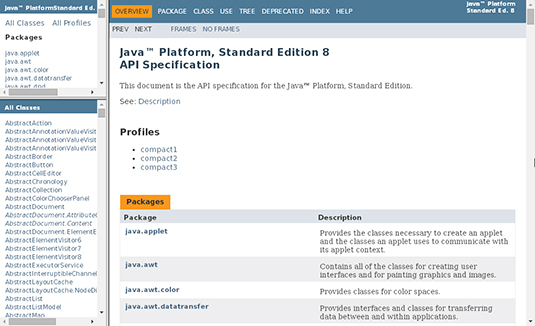
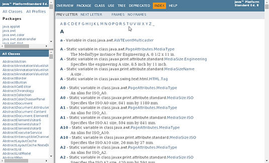
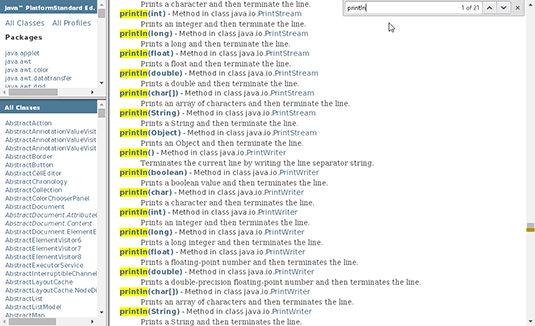
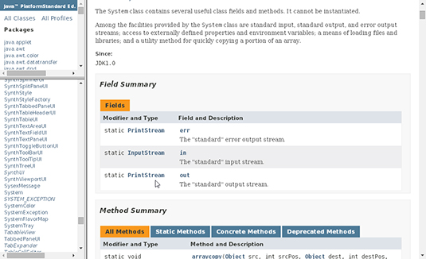
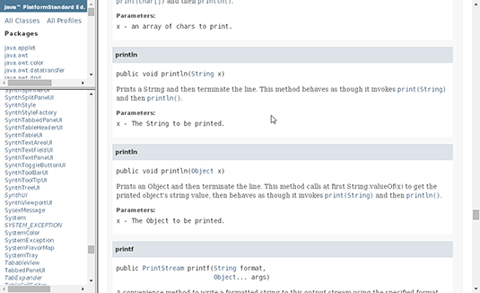
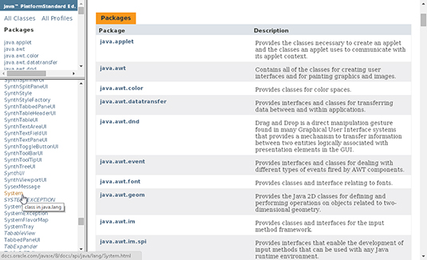
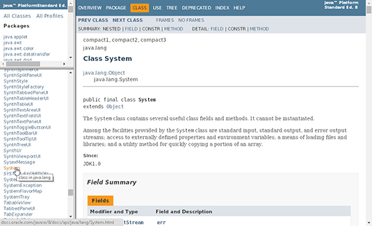

# Java

## Language Basics

## Variables

You've already learned that objects store their state in fields. However, the Java programming language also uses the term "variable" as well. This section discusses this relationship, plus variable naming rules and conventions, basic data types (primitive types, character strings, and arrays), default values, and literals.

## Operators

This section describes the operators of the Java programming language. It presents the most commonly-used operators first, and the less commonly-used operators last. Each discussion includes code samples that you can compile and run.

## Expressions, Statements, and Blocks

Operators may be used in building expressions, which compute values; expressions are the core components of statements; statements may be grouped into blocks. This section discusses expressions, statements, and blocks using example code that you've already seen.

## Control Flow Statements

This section describes the control flow statements supported by the Java programming language. It covers the decisions-making, looping, and branching statements that enable your programs to conditionally execute particular blocks of code.

## What does it mean to compile code?

As you may know, everything in a computer is represented by a series of 1's and 0's (which themselves represent high and low voltages on transistors, but that's a topic for another time). When the computer runs a program, the program itself is made of a bunch of 1's and 0's.

However, since we still need humans to write our programs, putting everything in 1's and 0's (called machine language) would be very difficult. So we made higher level languages like Java and C# to write code in. These languages look a lot more like English, so they're a lot easier to write and maintain.

When you compile code, the compilor (usually another program) takes the program the human wrote, and converts it into the program the computer can understand (i.e. converts from Java to machine language). The very short version could be, yes, compile means to make the code executable.

Something you may run into is people saying code does or does not compile. This means the compilor they used checks to make sure their program is written correctly according to the rules of the programming language. For example, most programming languages make you put a semicolon (;) at the end of every line. A very common mistake is to forget that semicolon, so when you try and compile the compilor gives you an error.

It's also important to note that just because the code compiles doesn't mean it works. It's sort of like how 3 + 4 < 5 is an equation that has the right form, but it is incorrect.

## [A webcomic of romance, sarcasm, math, and language.](https://xkcd.com/303/) 

### Making Sense of Java’s API Documentation

Once upon a time, people judged programming languages (including Java) solely by their grammatical features. Does an if statement do what you expect it to do? Are looping statements easy to use? Are methods implemented efficiently?

Nowadays, things are a bit different. Java has a whole collection of grammatical features, but Java is much more than just a big set of grammar rules. Java has a standard Application Programming Interface —a huge library consisting of over 4,000 classes, each with its own functionality, its own limitations, and its own rules for effective use.

Searching for a term
You can find things in the API documentation in a number of different ways. Each way is convenient in one situation or another. For example, Java has a method named System.out.println. What follows describes two ways to look up the System.out.println method.

## Using the index

1. Visit [docs.oracle.com/javase/8/docs/api/](docs.oracle.com/javase/8/docs/api/) 

2. Click the INDEX link at the top of the page to open the index, as shown in Figure 1.

A list of letters is near the top of the index (see Figure 2). Click the P link to go to the section with println in it.

###### Figure 2: The API documentation’s index page.

3. In the P section, do a search for println to find the println entries.
Most web browsers enable you to search for something like println in the text of a page. Here’s how:

* Make sure the browser knows that you want to search in the big frame that takes up most of the page (and not in the smaller frames on the left side of the page). To do this, click your mouse inside the big frame. (Don’t click a link. Click on some neutral white area of the frame.)

* Open the browser’s Find dialog box. On most Windows browsers, pressing Ctrl+F coaxes the Find dialog box out of hiding. On a Mac, clicking Command+F does the trick.

* When you see the Find dialog box, type println in the text box and click the box’s Find or Find Next button.

4. Pick one of the println entries.

The P section has a big boatload of println entries, as shown in Figure 3, below. The entries differ from one another in two ways:

- Each entry says println(int), println(String), or println(someOtherTypeName). The type name can differ from one entry to another.

- Each entry says that println is a method in class java.someStuff.someMoreStuff. The class can differ from one entry to another.

###### Figure 3: Some println entries in the API documentation’s index.

At this point, it pays to poke around. If you’re trying to print something like “Hello world!”, you want one of the println(String) entries. On the other hand, if you’re trying to print the value of lengthOfStraightLine, you’ll probably choose a println(double) entry.

Now, suppose you’ve decided on println(String). You can choose from three println(String) entries. One says it’s a method in class java.io.PrintStream, the next is a method in class java.io.PrintWriter, and the third is a method in class java.sql.DriverManager. Which of these three entries do you choose?

Well, what you’re really trying to call is something named System.out.println. If you go through the whole lookup rigmarole with Systemout, you’ll find that System.out has type PrintStream. (See Figure 4, below.) So the println(String) entry you decide to choose is

println(String) – Method in class java.io.PrintStream.

###### Figure 4: The out variable has type PrintStream.

5. Click the link for the entry that you’ve chosen.Click the link for the entry that you’ve chosen.
When you click the println(String) link, the browser takes you to a page that explains a println method, as shown in Figure 5. The page tells you what println does (“Print a String and then. . . .”) and points to other useful pages, like the page with the documentation for String.

###### Figure 5: A description of the println method.

## Using the list of classes

Here’s how to find an entry in the API by starting in the list of classes:

1. Visit [docs.oracle.com/javase/8/docs/api/.](docs.oracle.com/javase/8/docs/api/)

2. Find the page that documents the System class.

You’re looking for documentation that explains System.out.println. So you look up System, work your way to out, and from there, work your way to println.

To find a link to System, look in the lower frame on the left side of the page. (See Figure 6.) For hints on finding text on the page, see Step 3 in the “Using the index” section.

###### Figure 6: Finding a link to the System class.

Clicking the System link makes your browser display the documentation page for the System class, as shown in Figure 7.
 
 ###### Figure 7: The System class’s documentation

 3. On the documentation page for the System class, find the out variable.

If you use your web browser’s Find dialog box, you have to click the Find Next button several times. (The name out is so common, it appears several times in several different contexts on the System documentation page.) When you’ve found what you’re looking for, you see a table like the one shown in Figure 4, above.

4. In the table’s out row, click the PrintStream link.

According to the documentation, the out variable refers to an object of type PrintStream. This means that println is part of the PrintStream class. That’s why you’re clicking the PrintStream link.

5. On the documentation page for PrintStream, find println(String).

You see an explanation like the one shown in Figure 5, above.